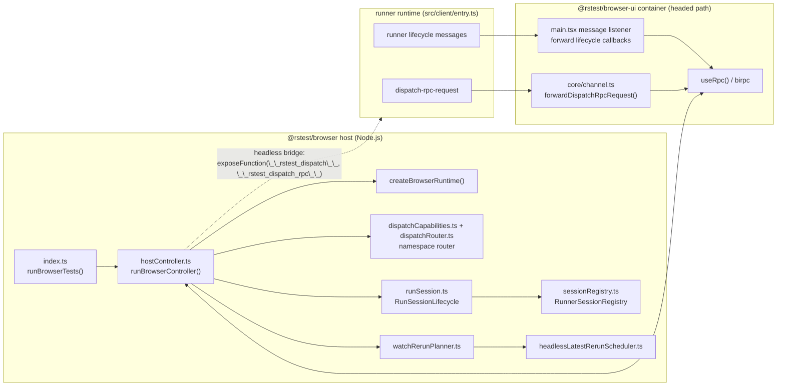
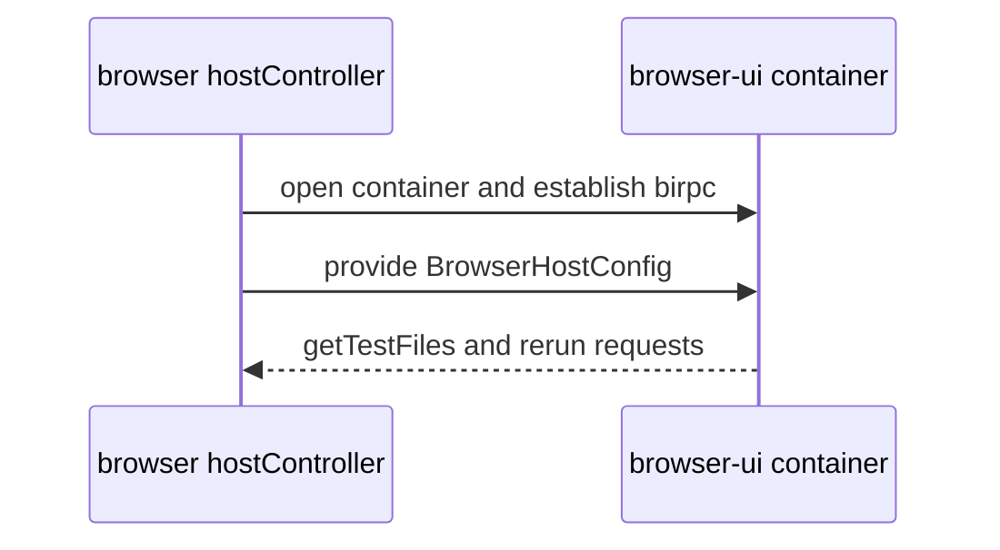
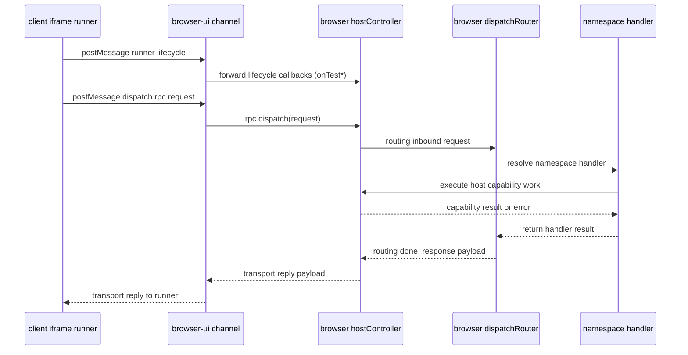
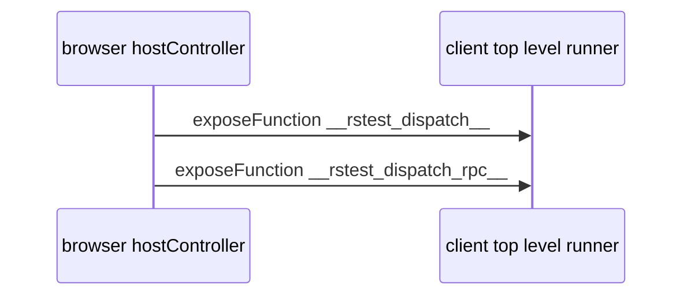
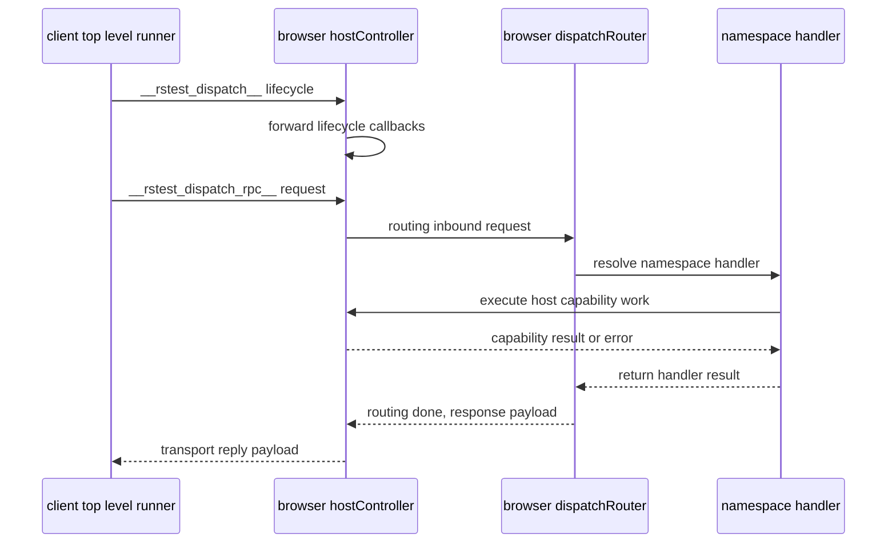

# Browser mode host architecture

This document is architecture-only and focuses on browser mode scheduling in `@rstest/browser` host-side modules.

## Module topology

## Headed transport path

Primary dispatch request direction is `Runner -> Container -> Host -> Router -> Handler`.
`Host -> Container` in this path is bootstrap setup and callback delivery, not router request initiation.
`dispatchRouter` handles inbound request routing only; outbound response delivery is a transport reply.

### Bootstrap control plane

### Runtime dispatch RPC data plane

## Headless transport path

Primary dispatch request direction is `Runner -> Host -> Router -> Handler`.
`Host -> Runner` in this path is bridge registration, not router request initiation.
`dispatchRouter` handles inbound request routing only; outbound response delivery is a transport reply.

### Bootstrap control plane

### Runtime dispatch RPC data plane

