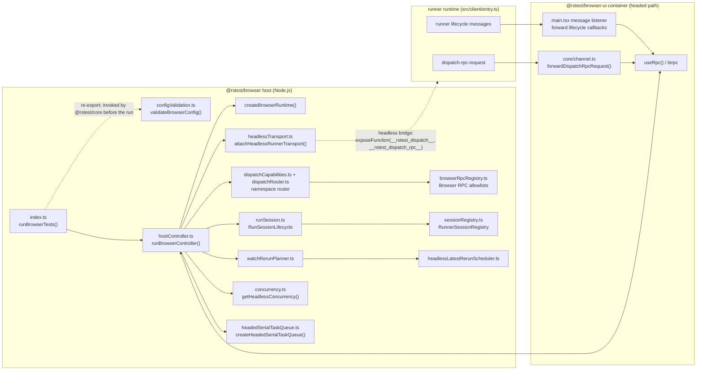
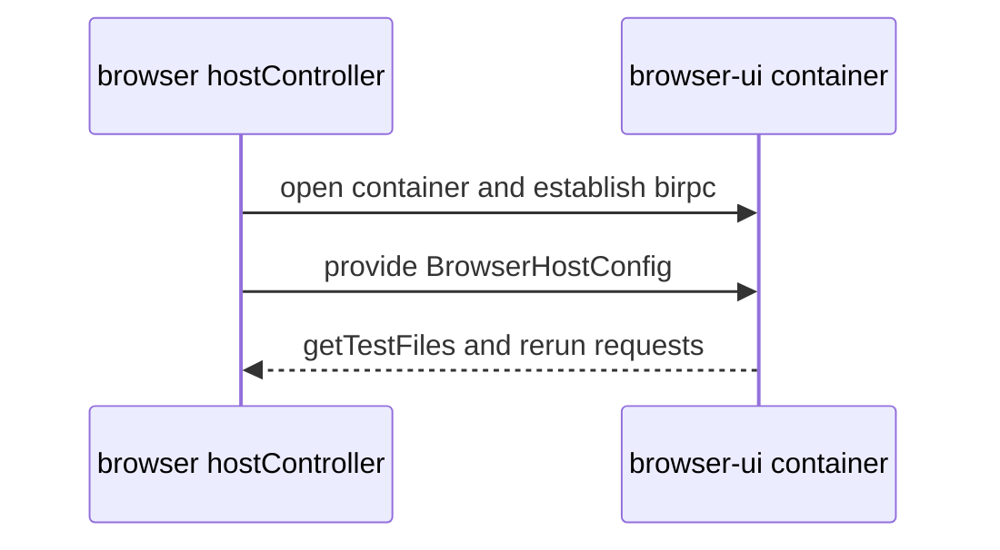
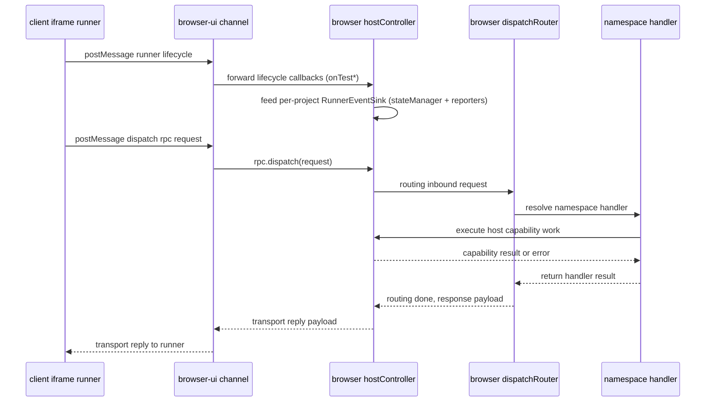
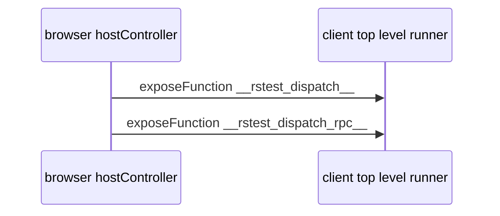
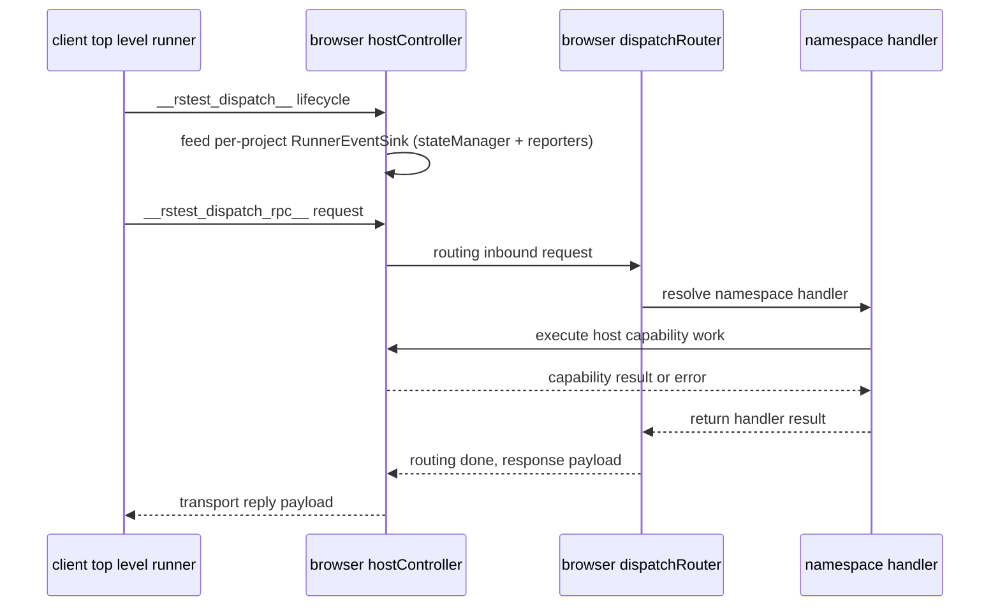

# Browser mode host architecture

This document is architecture-only and focuses on browser mode scheduling in `@rstest/browser` host-side modules.

## Run lifecycle ownership (browser/node isomorphism)

`runBrowserController` splits finalize ownership on `context.command`:

- **Non-watch runs**: the host never self-finalizes. It returns a fully-populated `BrowserTestRunResult` with a deferred `close`, and `@rstest/core`'s `finalizeRunCycle` reduces the run's `ExecutorCycleOutcome`s into the verdict — reporter `onTestRunEnd`, coverage merge + report, exit code, and the bail message. `BrowserTestRunOptions.skipOnTestRunEnd` is retained but ignored for one release.
- **Watch runs**: the host owns the per-rerun lifecycle (`onTestRunStart`/`onTestRunEnd` per rerun) and self-finalizes; core skips its finalize entirely for browser-only and zero-node mixed watch runs.

Runner lifecycle events flow through per-project `RunnerEventSink`s (`createRunnerEventSink` from core — the same event pump the node pool RPC uses). The host keeps a `Map<projectName, RunnerEventSink>` and resolves sinks via `sinkForProjectName`/`sinkForTestPath` (falling back to the first project for unknown names); it never fans out to reporters or `stateManager` directly.

Cross-file `bail` is enforced at file boundaries in the headless scheduler: before picking up the next file, each worker checks the cycle-wide `stateManager.getCountOfFailedTests()` and drains the remaining queue as skipped results once the budget is reached. The headed debugging UI does not apply bail; within a running file, the runner's per-test gate uses the client-local failed count (see `src/client/AGENTS.md`).

## Module topology

```mermaid
flowchart LR
  subgraph Host["@rstest/browser host (Node.js)"]
    IDX["index.ts\nrunBrowserTests()"]
    CV["configValidation.ts\nvalidateBrowserConfig()"]
    HC["hostController.ts\nrunBrowserController()"]
    RT["createBrowserRuntime()"]
    DR["dispatchCapabilities.ts + dispatchRouter.ts\nnamespace router"]
    BRR["browserRpcRegistry.ts\nBrowser RPC allowlists"]
    RL["runSession.ts\nRunSessionLifecycle"]
    SR["sessionRegistry.ts\nRunnerSessionRegistry"]
    WP["watchRerunPlanner.ts"]
    LS["headlessLatestRerunScheduler.ts"]
    HT["headlessTransport.ts\nattachHeadlessRunnerTransport()"]
    CC["concurrency.ts\ngetHeadlessConcurrency()"]
    HQ["headedSerialTaskQueue.ts\ncreateHeadedSerialTaskQueue()"]
  end

  subgraph UI["@rstest/browser-ui container (headed path)"]
    UR["useRpc() / birpc"]
    CH["core/channel.ts\nforwardDispatchRpcRequest()"]
    MH["main.tsx message listener\nforward lifecycle callbacks"]
  end

  subgraph Runner["runner runtime (src/client/entry.ts)"]
    MSG["runner lifecycle messages"]
    RPC["dispatch-rpc-request"]
  end

  IDX -."re-export; invoked by @rstest/core before the run".-> CV
  IDX --> HC
  HC --> RT
  HC --> DR
  DR --> BRR
  HC --> WP
  WP --> LS
  HC --> RL
  RL --> SR
  HC --> CC
  HC --> HQ
  HC --> HT

  UR <--> HC
  MSG --> MH
  MH --> UR
  RPC --> CH
  CH --> UR

  HT -."headless bridge:\nexposeFunction(__rstest_dispatch__, __rstest_dispatch_rpc__)".-> Runner
```

## Headed transport path

Primary dispatch request direction is `Runner -> Container -> Host -> Router -> Handler`.
`Host -> Container` in this path is bootstrap setup and callback delivery, not router request initiation.
`dispatchRouter` handles inbound request routing only; outbound response delivery is a transport reply.

### Bootstrap control plane

```mermaid
sequenceDiagram
  participant Host as browser hostController
  participant Container as browser-ui container

  Host->>Container: open container and establish birpc
  Host->>Container: provide BrowserHostConfig
  Container-->>Host: getTestFiles and rerun requests
```

### Runtime dispatch RPC data plane

```mermaid
sequenceDiagram
  participant Runner as client iframe runner
  participant Container as browser-ui channel
  participant Host as browser hostController
  participant Router as browser dispatchRouter
  participant Handler as namespace handler

  Runner->>Container: postMessage runner lifecycle
  Container->>Host: forward lifecycle callbacks (onTest*)
  Host->>Host: feed per-project RunnerEventSink (stateManager + reporters)

  Runner->>Container: postMessage dispatch rpc request
  Container->>Host: rpc.dispatch(request)
  Host->>Router: routing inbound request
  Router->>Handler: resolve namespace handler
  Handler->>Host: execute host capability work
  Host-->>Handler: capability result or error
  Handler-->>Router: return handler result
  Router-->>Host: routing done, response payload
  Host-->>Container: transport reply payload
  Container-->>Runner: transport reply to runner
```

## Headless transport path

Primary dispatch request direction is `Runner -> Host -> Router -> Handler`.
`Host -> Runner` in this path is bridge registration, not router request initiation.
`dispatchRouter` handles inbound request routing only; outbound response delivery is a transport reply.

### Bootstrap control plane

```mermaid
sequenceDiagram
  participant Host as browser hostController
  participant Runner as client top level runner

  Host->>Runner: exposeFunction __rstest_dispatch__
  Host->>Runner: exposeFunction __rstest_dispatch_rpc__
```

### Runtime dispatch RPC data plane

```mermaid
sequenceDiagram
  participant Runner as client top level runner
  participant Host as browser hostController
  participant Router as browser dispatchRouter
  participant Handler as namespace handler

  Runner->>Host: __rstest_dispatch__ lifecycle
  Host->>Host: feed per-project RunnerEventSink (stateManager + reporters)

  Runner->>Host: __rstest_dispatch_rpc__ request
  Host->>Router: routing inbound request
  Router->>Handler: resolve namespace handler
  Handler->>Host: execute host capability work
  Host-->>Handler: capability result or error
  Handler-->>Router: return handler result
  Router-->>Host: routing done, response payload
  Host-->>Runner: transport reply payload
```
