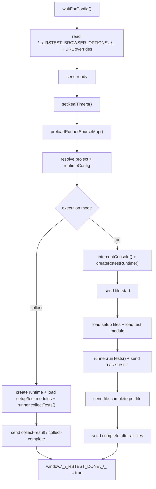
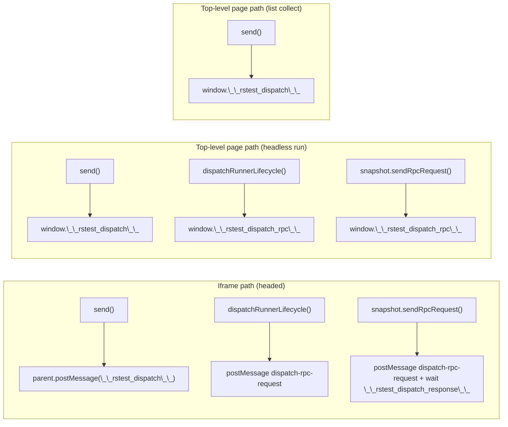
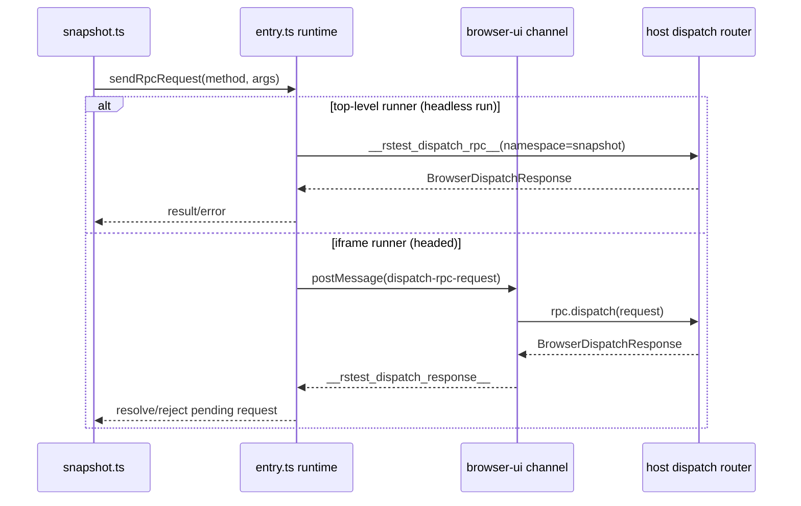

# Browser mode runner architecture

This document is architecture-only and focuses on the browser runner runtime in `src/client`.

## Runner bootstrap pipeline

## Transport architecture

## Snapshot RPC sequence

List collect mode does not use the snapshot RPC namespace.

## Runtime invariants

- `entry.ts` is the only bootstrap entry and decides `collect` vs `run` mode.
- Runner lifecycle events (`file-ready`, `suite-start`, `suite-result`, `case-start`) go through the `runner` dispatch namespace.
- Snapshot file operations go through the `snapshot` dispatch namespace and never access filesystem directly in browser runtime.
- Console interception is per test file and must restore original console methods in `finally`.
