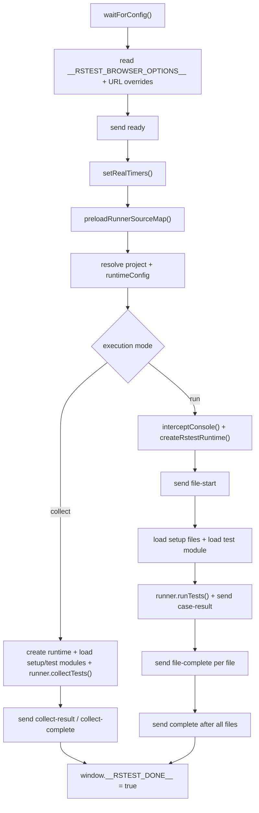
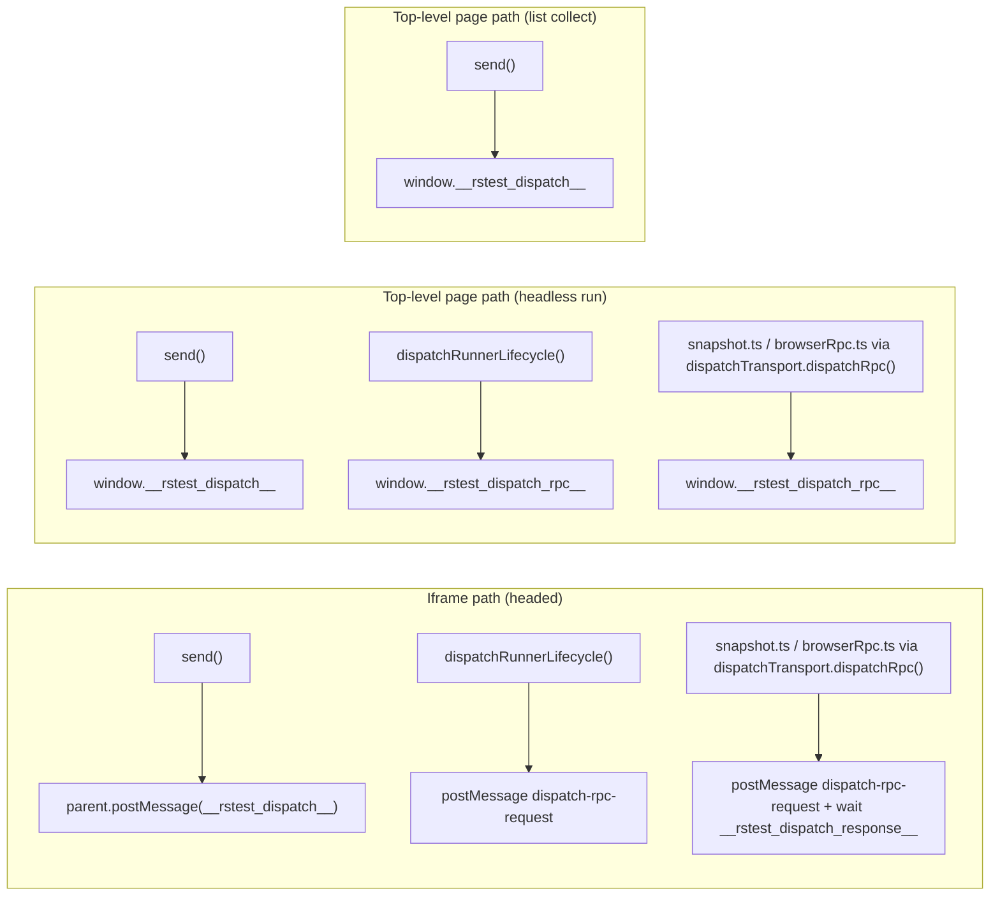
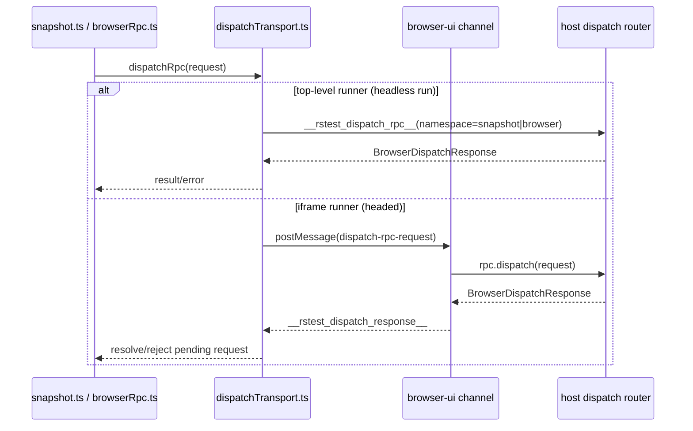

# Browser mode runner architecture

This document is architecture-only and focuses on the browser runner runtime in `src/client`.

## Runner bootstrap pipeline

```mermaid
flowchart TD
  A["waitForConfig()"] --> B["read __RSTEST_BROWSER_OPTIONS__ + URL overrides"]
  B --> R["send ready"]
  R --> C["setRealTimers()"]
  C --> D["preloadRunnerSourceMap()"]
  D --> E["resolve project + runtimeConfig"]
  E --> F{"execution mode"}

  F -->|collect| G["create runtime + load setup/test modules + runner.collectTests()"]
  G --> H["send collect-result / collect-complete"]

  F -->|run| I["interceptConsole() + createRstestRuntime()"]
  I --> J["send file-start"]
  J --> K["load setup files + load test module"]
  K --> L["runner.runTests() + send case-result"]
  L --> N["send file-complete per file"]
  N --> O["send complete after all files"]

  H --> M["window.__RSTEST_DONE__ = true"]
  O --> M
```

## Transport architecture

```mermaid
flowchart LR
  subgraph IframePath["Iframe path (headed)"]
    S1["send()"] --> P1["parent.postMessage(__rstest_dispatch__)"]
    R1["dispatchRunnerLifecycle()"] --> P2["postMessage dispatch-rpc-request"]
    SN1["snapshot.ts / browserRpc.ts via dispatchTransport.dispatchRpc()"] --> P3["postMessage dispatch-rpc-request + wait __rstest_dispatch_response__"]
  end

  subgraph TopLevelRunPath["Top-level page path (headless run)"]
    S2["send()"] --> D1["window.__rstest_dispatch__"]
    R2["dispatchRunnerLifecycle()"] --> D2["window.__rstest_dispatch_rpc__"]
    SN2["snapshot.ts / browserRpc.ts via dispatchTransport.dispatchRpc()"] --> D3["window.__rstest_dispatch_rpc__"]
  end

  subgraph TopLevelCollectPath["Top-level page path (list collect)"]
    S3["send()"] --> C1["window.__rstest_dispatch__"]
  end
```

## Dispatch RPC sequence (snapshot / browser namespaces)

The `snapshot` namespace (snapshot file ops) and the `browser` namespace
(locator/page RPC from `browserRpc.ts`) share one client channel:
`dispatchTransport.ts` owns request ids, timeouts, and pending-response
resolution for both the iframe and top-level transports.

```mermaid
sequenceDiagram
  participant Caller as snapshot.ts / browserRpc.ts
  participant Transport as dispatchTransport.ts
  participant Container as browser-ui channel
  participant Host as host dispatch router

  Caller->>Transport: dispatchRpc(request)

  alt top-level runner (headless run)
    Transport->>Host: __rstest_dispatch_rpc__(namespace=snapshot|browser)
    Host-->>Transport: BrowserDispatchResponse
    Transport-->>Caller: result/error
  else iframe runner (headed)
    Transport->>Container: postMessage(dispatch-rpc-request)
    Container->>Host: rpc.dispatch(request)
    Host-->>Container: BrowserDispatchResponse
    Container-->>Transport: __rstest_dispatch_response__
    Transport-->>Caller: resolve/reject pending request
  end
```

List collect mode does not use the snapshot or browser RPC namespaces.

## Runtime invariants

- `entry.ts` is the only bootstrap entry and decides `collect` vs `run` mode.
- Runner lifecycle events (`file-ready`, `suite-start`, `suite-result`, `case-start`) go through the `runner` dispatch namespace.
- Snapshot file operations go through the `snapshot` dispatch namespace and never access filesystem directly in browser runtime.
- Console interception is per test file and must restore original console methods in `finally`.
- An unhandled window error or `unhandledrejection` that escapes a test file fails the file even when every test passed. Before finalizing each file result, the runner yields two macrotasks so a rejection leaked by a synchronous test is still observed (the browser dispatches `unhandledrejection` in a task queued after the current task).
- The `getCountOfFailedTests` runner hook returns the client-local per-file failed count; cross-file `bail` is enforced host-side at file boundaries (see `../AGENTS.md`), not by this hook.
