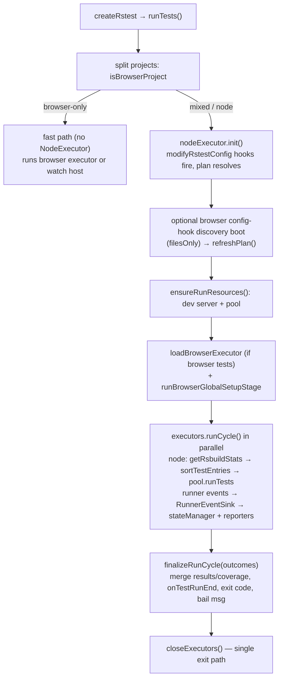

# Run-cycle orchestration

Architecture of `packages/core/src/core` (excluding `plugins/`): how a run travels from the `Rstest` context through Rsbuild, the executor seam, and the shared finalize. The package-level `../../AGENTS.md` summarizes the executor contract; this is the deep-dive.

## Purpose and entry points

- `createRstest` (`index.ts:11`) builds the `Rstest` context and lazily imports `runTests` / `listTests` / `mergeReports` (`index.ts:54`).
- `Rstest` (`rstest.ts:72`) is the run-wide context: normalizes per-project configs — copying root-only `isolate`/`coverage`/`bail`/`resolveSnapshotPath`/`onConsoleLog` down to each project (`rstest.ts:175`) — and owns `stateManager` (`rstest.ts:99`), reporters, and `snapshotManager`.
- `runTests` (`runTests.ts:111`) is the orchestration entry. It splits projects with `isBrowserProject` (`runTests.ts:129`, `isBrowserProject.ts:10` — `browser.enabled` is frozen pre-plugin, so this one predicate routes everything).
- Executor seam: `TestExecutor` (`../types/executor.ts:96`), `ExecutorRunCycleOptions` (`../types/executor.ts:13`), `ExecutorCycleOutcome` (`../types/executor.ts:53`). Node side: `createNodeExecutor` (`executors/nodeExecutor.ts:180`). Browser side: obtained through `loadBrowserExecutor` (`browserLoader.ts:190`) over the version-locked dynamic import `loadBrowserModule` (`browserLoader.ts:91`), whose module shape is the core-owned `BrowserHostModule` contract (`browserLoader.ts:52`).
- Contract trio: `finalizeRunCycle` (`finalizeRun.ts:189`), `RunnerEventSink` (`runnerEventSink.ts:26`, factory `runnerEventSink.ts:48`), and the `executorCapabilities` table (`executorCapabilities.ts:27`) with the wire projection `projectRuntimeConfig` (`runtimeConfigProjection.ts:39`).
- Plan/discovery: `createRunProjectPlanState` (`projectPlan.ts:72`), `resolveRunnableProjects` (`projectPlan.ts:129`). Build: `prepareRsbuild` (`rsbuild.ts:161`), `createRsbuildServer` (`rsbuild.ts:426`), per-environment `getRsbuildStats` (`rsbuild.ts:550`). Scheduling: `sortTestEntries` (`testSequencer.ts:20`) with hints from `readResultsCache` (`resultsCache.ts:64`).

## Data flow

Non-watch mixed runs settle every cycle before propagating a failure (`runTests.ts:720`), then feed all outcomes into one `finalizeRunCycle` (`runTests.ts:723`). Watch mode instead registers `onAfterDevCompile`, which calls `prepareWatchRerunState` then `run()` per rebuild (`runTests.ts:924`), driving only the node executor (`runTests.ts:830`); the dev server is started _after_ the hooks are registered (`runTests.ts:1045`), and only then may the self-finalizing browser watch session launch (`runTests.ts:1049`).

## Key invariants

- **Single finalize; exit codes never downgrade.** Every non-watch path that completes exits through `finalizeRunCycle` exactly once — including the mixed/node empty-run path (`runTests.ts:549`) — with one exception: the browser-only fast path with an empty related-test resolution short-circuits through `reportNoTestFiles` + `notifyReportersOnTestRunEnd` (`runTests.ts:200`) and never reaches `finalizeRunCycle`; a cycle that rejects propagates its error (`runTests.ts:721`) instead of finalizing. Exit codes never downgrade: a failure sets `process.exitCode = 1` only when it is unset/zero (`finalizeRun.ts:297`); `reportNoTestFiles` applies the same rule for `passWithNoTests` (`finalizeRun.ts:47`).
- **Single-exit-path close.** All executors close through the idempotent `closeExecutors` (`runTests.ts:600`), which reads `executors` at close time so a browser executor pushed mid-try is covered; `NodeExecutor.close` is itself idempotent and settles an in-flight resource start before tearing down (`executors/nodeExecutor.ts:588`).
- **`stateManager` reset is core-owned.** Top-of-run for non-watch (`runTests.ts:140`), `prepareWatchRerunState` per watch rerun (`watchState.ts:14`) — executors never reset it (`executors/nodeExecutor.ts:366`). Bail reads (`stateManager.ts:63`) are therefore cycle-scoped.
- **All runner lifecycle events go through `RunnerEventSink`,** one per project bound to that project's `normalizedConfig` (`runnerEventSink.ts:48`; pool creates them at `../pool/index.ts:346`). No direct reporter/`stateManager` fanout.
- **Every `RuntimeConfig` field needs a capabilities row.** The exhaustive `Record<keyof RuntimeConfig, …>` makes a missing row a compile error (`executorCapabilities.ts:27`); `browserStrippedRuntimeConfigKeys` / `browserIgnoredRuntimeConfigKeys` derive from it (`executorCapabilities.ts:68`).
- **Init barrier and ordering.** `nodeExecutor.init()` runs before any browser executor is constructed (`runTests.ts:373`), and node run resources start before the browser executor loads so a node dependency failure never leaves a browser mid-launch (`runTests.ts:588`).
- **Version lock.** `@rstest/browser` must equal core's version or the load fails (`browserLoader.ts:132`); `embedded` throws instead of `process.exit(1)` (`browserLoader.ts:133`).
- **Browser-only cold-start gate.** Pure-browser runs never construct a `NodeExecutor` (`runTests.ts:193`).
- **Results cache is never poisoned.** Node skips the cache write on `testNamePattern` runs and bail-aborted runs (`executors/nodeExecutor.ts:554`).

## Coupling points

- Add/change a `RuntimeConfig` field → add its row in `executorCapabilities.ts:27` **and** the hand-destructured field list in `projectRuntimeConfig` (`runtimeConfigProjection.ts:51`); the projection does not read the table at runtime — lockstep is test-enforced (`../../tests/core/executorCapabilities.test.ts:56`).
- Add a runner event → both `RunnerEventSink` (`runnerEventSink.ts:26`) and the wire `RuntimeRPC`; the compile-time guard collapses to `never` on one-sided changes (`runnerEventSink.ts:165`), and `sinkToRuntimeRpc` (`runnerEventSink.ts:145`) adapts.
- Change `ExecutorCycleOutcome` (`../types/executor.ts:53`) → update the node outcome assembly (`executors/nodeExecutor.ts:562`), the browser host's outcome, and the reduction in `finalizeRunCycle` (`finalizeRun.ts:223`, coverage merge `finalizeRun.ts:231`).
- Change `BrowserHostModule` (`browserLoader.ts:52`) → `@rstest/browser`'s public entry constrains its exports against it via `satisfies` (`browserLoader.ts:124`).
- Change watch rerun reset semantics → `prepareWatchRerunState` (`watchState.ts:14`) is called by the node rebuild path (`runTests.ts:925`) **and** the browser host's rerun scheduler; keep both.
- `resolveRunnableProjects` mutates `context.projects` (`projectPlan.ts:178`) → executors capture their project subset at construction (`../types/executor.ts:104`); never re-derive from `context` inside an executor.
- `hostServerConfig` (`rsbuild.ts:152`) is shared with the browser globalSetup stage's one-shot compile — change it in one place only.

## Gotchas

- **Watch re-entry:** the dev server's first compile fires `onAfterDevCompile` → `runCycle` → `ensureRunResources` _while the initial `ensureRunResources` is still starting that server_; the memoized promise (`executors/nodeExecutor.ts:227`) is what prevents a second server + pool.
- **Discovery boot:** mixed runs whose browser projects carry `modifyRstestConfig` hooks boot the browser side once in `filesOnly` mode, then `refreshPlan()` (`runTests.ts:504`), because such a hook can add files to an otherwise-empty browser project. The shared `appliedModifyRstestConfigEnvironments` set keeps hooks single-shot across discovery and the real run (`runTests.ts:417`).
- **Watch finalize split:** browser watch self-finalizes host-side; core's finalize is skipped for browser-only watch (`runTests.ts:234`) and zero-node mixed watch (`runTests.ts:761`). The unawaited browser watch session promise surfaces boot failures via `.catch` + `process.exitCode = 1` (`runTests.ts:805`).
- **Presentation vs execution order:** reporter output is sorted by `testPath` (`rstest.ts:312`), deliberately decoupled from the perf-first execution order (failed-first, then LPT — `testSequencer.ts:1`). Don't "fix" one by changing the other.
- **On-demand diff is consuming:** `calcEntriesToRerun` updates its `buildData` baseline per call (`rsbuild.ts:260`); a setup-entry change reruns _all_ entries (`rsbuild.ts:399`). This is why `TestExecutor.onInvalidate` is signal-only (`../types/executor.ts:125`) — resolving affected entries in the hook would double-consume the baseline.
- **Browser env is an overlay, not an env:** the `static` projection's `envOverlay` is a post-globalSetup change-set; passing full `process.env` would leak host env onto the browser wire (`runtimeConfigProjection.ts:20`). Node's projection reads env at projection time so globalSetup mutations are captured (`runtimeConfigProjection.ts:131`).
- **Module resolution order** for `@rstest/browser`: project roots → cwd → core's own location (`browserLoader.ts:101`); only module-not-found errors (`ERR_MODULE_NOT_FOUND` / `MODULE_NOT_FOUND`) fall through to the next base; any other error rethrows (`browserLoader.ts:157`).
- **Trace buffers are pre-allocated** before the browser-only fast path (`runTests.ts:183`) and re-allocated after each watch rerun (`runTests.ts:848`) so browser events between cycles are not dropped; the fast path must reuse the pre-allocated buffer, not `beginRun()` again (`runTests.ts:222`).
- **Browser globalSetup stage mutates host `process.env`** (`runTests.ts:692`), so its env changes are visible to node workers in the same mixed run.

## List command path

`rstest list` (`listTests.ts:447`, lazily imported like `runTests` at `index.ts:60`) is a collect-only sibling of the run path: it reuses the Rsbuild build and the pool, but tests are collected, never executed — no `TestExecutor.runCycle`, no `finalizeRunCycle`.

- **Zero reporters by design.** `Rstest` skips `createReporters` entirely when `command === 'list'` (`rstest.ts:249`); all output is hand-printed via `logger` inside `listTests`. The pool still wires a per-project `RunnerEventSink` (`../pool/index.ts:487`), it just fans out to an empty reporter list.
- **Node collection reuses the run pipeline minus execution.** `collectNodeTests` (`listTests.ts:148`) does `prepareRsbuild` → `createRsbuildServer` (always `isWatchMode: false`, `listTests.ts:193`) → `createPool` → per-project `getRsbuildStats` → `pool.collectTests` (`listTests.ts:248`), which dispatches `type: 'collect'` tasks (`../pool/index.ts:493`); a worker failure becomes a per-file `errors` entry, not a run abort (`../pool/index.ts:510`).
- **`globalSetup` genuinely runs** (collection executes module top-level code): setup at `listTests.ts:231`, teardown inside `close` (`listTests.ts:273`); a setup failure yields an empty list plus errors (`listTests.ts:239`).
- **Node list is not on the executor seam yet.** `TestExecutor.collect` is optional and only the browser executor implements it (`../types/executor.ts:113`); node stays in `listTests.ts`'s dedicated plan-state flow until a later phase converges it.
- **Browser collection goes through the seam:** `loadBrowserExecutor` with a `null` coverage provider, then `executor.collect({ shardedEntries })` (`listTests.ts:312`, `listTests.ts:317`) — the import stays dynamic so node-only lists never load the browser module (`listTests.ts:311`).
- **Plan state is list-specific.** `createListProjectPlanState` (`projectPlan.ts:222`) memoizes per-environment entries; `refreshListEntries` rebuilds them after `modifyRstestConfig` hooks fire (`listTests.ts:661`). `--filesOnly` skips the pool entirely (`collectTestFiles` just globs, `listTests.ts:321`), yet node projects still run `prepareRsbuild` + `initConfigs` purely to fire config hooks (`listTests.ts:601`, `listTests.ts:616`), and browser projects with such hooks get a `filesOnly: true` discovery boot (`applyBrowserFilesOnlyConfigHooks`, `listTests.ts:540`) gated on whether file filters point inside the project (`listTests.ts:558`).
- **Sharding is global, then frozen.** The shard flattens every project's entries into one list, sorts by `testPath`, and slices (`../utils/shard.ts:62`, `../utils/shard.ts:21`) — so hook-driven entry changes shift the whole cross-project partition. Mixed node+browser lists therefore collect node first (`collectBrowserAfterConfigHooks`, `listTests.ts:390`) and pass `freezeShardedEntries` (`listTests.ts:384`) so the browser host uses core's shard instead of recomputing a different global shard post-hooks (`../types/browser.ts:33`; honored at `../../../browser/src/hostController.ts:1565`). The "Running shard i of n" banner is deferred until after hooks via the `silentShardMessage` juggling (`listTests.ts:536`).
- **Output formats:** `skip`/`todo` tests are excluded from listing (`listTests.ts:673`); `--json` prints to stdout for `true`/`'true'` or, given a path, writes a file creating parent dirs (`listTests.ts:792`); `--printLocation` appends `:line:column` (`listTests.ts:818`); `--summary` adds matched counts to both text and JSON shapes (`listTests.ts:110`).
- **Exit semantics:** any per-file collect or globalSetup error sets `process.exitCode = 1` and returns before any test listing (`listTests.ts:696`). Human-readable `FAIL` / `Unhandled Error` blocks with source-mapped stacks (`listTests.ts:710`, `listTests.ts:728`) are printed only when JSON is not going to stdout; with `--json`, a `{ errors: [{ file?, name, message, stack }] }` payload is emitted to stdout or the given file instead (`listTests.ts:741`). An unhandled throw exits via the CLI wrapper's `process.exit(1)` (`../cli/commands.ts:1072`). An empty related-test resolution still emits the empty JSON/summary shape and exits 0 (`listTests.ts:488`).

## Trace-event pipeline

`--trace` is a CLI-only switch — registered at `../cli/commands.ts:102`, marked not-user-config on the context option (`../types/core.ts:112`) — that dumps a Perfetto trace JSON plus a ranked markdown summary. Core owns every concern through `createTraceController` (`../utils/trace.ts:298`): `runTests` constructs it once per run, before the browser-only fast path so pure-browser runs are traced too (`runTests.ts:177`), and only wires `onEvents` / `span` / `finalize` at lifecycle points.

- **Three emitters, one per-run buffer.**
  - _Node workers:_ `PhaseTracker` (`../runtime/worker/phaseTracker.ts:64`) is constructed per file but records phase/suite/case slices plus heap counters only when `context.trace` is true — `../pool/index.ts:143` stamps the flag on every task context, and `../runtime/worker/runInPool.ts:520` gates the tracker options on it (undefined options make it a no-op). Events ride home on `TestFileResult.traceEvents` (`../runtime/worker/runInPool.ts:747`, `../types/testSuite.ts:211`) and are stripped at the pool boundary into the caller's `onTraceEvents` (`../pool/index.ts:457`) so they never reach reporters or the state manager.
  - _Host:_ `TraceRun.span` records host-side slices (`../utils/trace.ts:321`); the node executor pulls the live run via `getTraceRun` (`runTests.ts:371`, `executors/nodeExecutor.ts:380`), and `pool.runTests` takes `traceSpan` as a required parameter (`../pool/index.ts:267`) — `noopTraceSpan` (`../utils/trace.ts:43`) exists so call sites never branch on whether tracing is on.
  - _Browser:_ the host receives `onTraceEvents` through `ExecutorRunCycleOptions` / `BrowserTestRunOptions` (`../types/executor.ts:38`, `../types/browser.ts:64`), instantiates core's re-exported `PhaseTracker` per file (`../browser.ts:74`, `packages/browser/src/hostController.ts:2179`) with a synthetic per-file pid (`packages/browser/src/hostController.ts:2800`), and flushes each tracker on file finish (`packages/browser/src/hostController.ts:2885`).
- **Buffer lifecycle.** `beginRun()` pre-allocates before the fast path (`runTests.ts:183`) and again after each watch-rerun finalize (`runTests.ts:848`); `forwardBrowserTraceEvents` reads `activeTraceRun` at call time (`runTests.ts:184`) so between-cycle browser events land in the fresh buffer. The browser-only fast path must reuse the pre-allocated buffer, not `beginRun()` again (`runTests.ts:222`) — a second `beginRun()` would leave the first as a dead, never-finalized twin. When tracing is disabled, `beginRun` returns `onEvents: undefined` + noop span so the pool skips collection entirely (`../utils/trace.ts:313`).
- **Output.** Each buffer is finalized through `finalizeRunCycle` (`finalizeRun.ts:327`), watch cleanup (`runTests.ts:862`), or `traceController.shutdown` (`../utils/trace.ts:443`, invoked at `runTests.ts:358`, `runTests.ts:560`, `runTests.ts:774`), plus direct cleanup hooks — non-watch signal cleanup (`runTests.ts:630`), `onBeforeRestart` (`runTests.ts:906`), and the CLI-shortcut `closeServer` (`runTests.ts:936`). Note `finalize` is not re-entry-guarded (only `if (!events.length) return`, `../utils/trace.ts:353`; the buffer is never cleared), and the fast path's `shutdown` re-invokes it after `finalizeRunCycle` already ran it — so browser-only non-watch runs currently finalize twice: the second pass writes a new timestamped pair replacing the first and reprints the summary. `finalize` writes `.rstest/trace-<stamp>.json` and a `.summary.md` sidecar (`../utils/trace.ts:59`), prints the summary to stdout (`../utils/trace.ts:379`), and in an interactive TTY starts a helper server pinned to `127.0.0.1:9001` — the only port Perfetto UI's CSP permits (`../utils/trace.ts:158`); non-TTY skips the server so CI never hangs (`../utils/trace.ts:392`). Watch reruns replace the previous rerun's pair (`../utils/trace.ts:360`).
- **Coupling points other subsystems must respect:**
  - Perfetto process/thread labeling keys off `args.testPath` on every slice (`../utils/trace.ts:114`); `PhaseTracker` stamps `testPath`/`project` on each event (`../runtime/worker/phaseTracker.ts:172`) and host spans use `testPath: '<host>'` (`../utils/trace.ts:336`). Emit an unstamped slice and its track goes unlabeled.
  - `tid` need only be unique within a `pid`; worker_threads therefore get a synthetic pid (`../runtime/worker/runInPool.ts:33`) — a new emitter must keep `(pid, tid)` collision-free.
  - The summary treats `phase`/`suite`/`case` as worker categories and everything else as host spans (`../utils/traceSummary.ts:15`); a new worker-side slice category must join that set or it will be ranked as host time.
  - `onEvents` iterates instead of spreading — `push(...chunk)` overflows V8's argument limit on files with thousands of cases (`../utils/trace.ts:348`).

<!-- Insertion note: the "Buffer lifecycle" bullet above supersedes the standalone gotcha currently at packages/core/src/core/AGENTS.md line 62 ("Trace buffers are pre-allocated… runTests.ts:183/848/222"); remove that line when inserting this section so the buffer-lifecycle facts live in one place. -->
