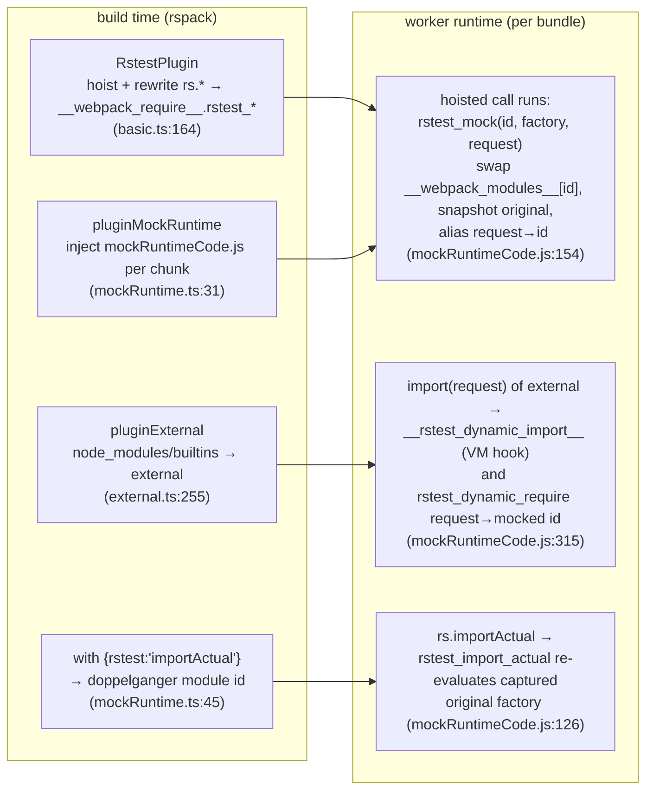

# Build plugins: module-graph shaping and the mock seam

Rsbuild/Rspack plugins that turn user test files into runnable bundles. This directory owns the build half of `rs.mock`: hoisting/rewriting happens at build time inside rspack's native `RstestPlugin`; actual mock registration and lookup happen at runtime inside an injected webpack runtime module (`mockRuntimeCode.js`). Registered for the node build at `../rsbuild.ts:215` and for globalSetup builds at `../browserGlobalSetup.ts:127`; the browser host reuses the target-agnostic mock pieces via `applyWebMockRspackConfig` (exported through `../../browser.ts:57`, consumed at `../../../../browser/src/hostController.ts:1833`).

## Purpose and entry points

- `pluginBasic` (`basic.ts:25`) — per-environment config: `import.meta.rstest` define (`basic.ts:91`), rewrites `import()` callee to the VM hook via `output.importFunctionName` (`basic.ts:134`), registers `rspack.experiments.RstestPlugin` with mock options plus node-pool extras (`basic.ts:147`, `basic.ts:164`), `.wasm` rule (`basic.ts:181`), parser freezes (`basic.ts:200`), shared runtime chunk (`basic.ts:251`).
- `mockBuild.ts` — target-agnostic mock parameterization: `getMockRstestPluginOptions` (`mockBuild.ts:94`, incl. `manualMockRoot` = `<rootPath>/__mocks__` at `mockBuild.ts:100`), `importMetaRstestDefine` (`mockBuild.ts:20`), `rstestCoreGlobalExternal` (`mockBuild.ts:110`), `applyWebMockRspackConfig` (`mockBuild.ts:140`) with the web-only chunk-install guard (`mockBuild.ts:51`).
- `pluginMockRuntime` (`mockRuntime.ts:38`) — injects `mockRuntimeCode.js` into every chunk's webpack runtime (`mockRuntime.ts:31`) and registers the `with { rstest: 'importActual' }` doppelganger rule (`mockRuntime.ts:45`) using the identity loader `importActualLoader.mjs:2`.
- `mockRuntimeCode.js` — the in-bundle mock registry: proxied `__webpack_require__` (`mockRuntimeCode.js:6`), original-module/factory snapshots (`mockRuntimeCode.js:34`), request→mocked-id alias map (`mockRuntimeCode.js:43`), `rstest_mock` family (`mockRuntimeCode.js:290`), `rstest_import_actual` (`mockRuntimeCode.js:126`), `rstest_dynamic_require` (`mockRuntimeCode.js:315`).
- `pluginExternal` (`external.ts:255`) — externalizes resolved `node_modules` files to their absolute paths (`external.ts:215`), node builtins (`external.ts:221`), and keeps `@rstest/core` external against the runtime global (`external.ts:300`).
- `pluginEntryWatch` (`entry.ts:29`) — entry assembly per environment and watch-mode ignore/debounce config (`entry.ts:60`).
- `pluginIgnoreResolveError` (`ignoreResolveError.ts:19`), `pluginInspect` (`inspect.ts:12`), `pluginCacheControl` (`moduleCacheControl.ts:72`, only under `isolate: false`, `../rsbuild.ts:227`), `wasmLoader.mjs:35`.

## Data flow

Build time: rspack's native `RstestPlugin` (options from `mockBuild.ts:94`, registered `basic.ts:164`) hoists `rs.mock`/`rs.hoisted` blocks above bundled imports, resolves specifiers to module ids, and rewrites `rs.*` mock calls into `__webpack_require__.rstest_*` calls. The plain JS API is only a throwing stub — `rs.mock()` reaching runtime untransformed throws (`../../runtime/api/utilities.ts:56`). Registration therefore happens at runtime, when the hoisted call executes against the registry that `pluginMockRuntime` injected.

`rs.unmock` restores the captured factory and drops the request alias (`mockRuntimeCode.js:100`); `rs.resetModules` clears the module cache except mocked ids (`mockRuntimeCode.js:322`).

## Key invariants

- Setup files and test files must share one webpack runtime — mock state lives on that runtime's `__webpack_require__`, enforced by `runtimeChunk.name` (`basic.ts:251`) from the single source of truth `../runtimeChunk.ts:13`.
- `@rstest/core` must stay external to the runtime-published global (`external.ts:300`, web: `mockBuild.ts:157`): the hoister puts `rs.hoisted` callbacks above bundled imports, so a bundled/aliased provider module would load too late (`mockBuild.ts:152`). The worker publishes the global at `../../runtime/worker/runInPool.ts:301` under `RSTEST_API_GLOBAL_KEY` (`../../utils/constants.ts:40`).
- The VM hook identifiers are owned by `../../runtime/worker/runtimeHooks.ts:12`; the emit side (`basic.ts:134`, `basic.ts:156`) and the consume side (`../../runtime/worker/loadModule.ts:210`, `../../runtime/worker/loadEsModule.ts:225`) must stay byte-identical.
- Parser freezes at `basic.ts:200` are load-bearing: `url: false` (`basic.ts:217`) keeps `new URL(..., import.meta.url)` source-relative for ALL asset reads and the wasm path; `importDynamic`/`requireDynamic`/`requireResolve: false` keep dynamic expressions for runtime resolution.
- `exportsPresence: 'warn'` must apply wherever the mock transform runs (`mockBuild.ts:118`; node at `basic.ts:220`, web at `mockBuild.ts:159`) — mock factories may add exports the real module lacks.
- Module-not-found is a runtime error, never a build error: resolve failure externalizes as `node-commonjs` because the module may be mocked (`external.ts:190`), and `pluginIgnoreResolveError` splices the build errors (`ignoreResolveError.ts:9`) with `emitOnErrors` (`ignoreResolveError.ts:25`).

## Coupling points

- `rstest_*` member names in `mockRuntimeCode.js` are the wire contract with rspack's native `RstestPlugin` emit — renaming either side alone breaks mocking; the web install-guard string also hard-codes `rstest_original_modules`/`rstest_original_module_factories` (`mockBuild.ts:38` ↔ `mockRuntimeCode.js:34`).
- `importMetaRstestDefine('node')` (`mockBuild.ts:20`) ↔ worker global assignment (`../../runtime/worker/runInPool.ts:301`); the `'web'` form ↔ browser client per-file `globalThis` assignment (`../../../../browser/src/hostController.ts:1833` build side).
- `mockRuntimeCode.js:93` reads `globalThis.RSTEST_API` for `mockObject` spying ↔ published at `../../runtime/api/index.ts:86`.
- `pluginCacheControl` transform appends `rstest_register_setup_id` calls (`moduleCacheControl.ts:101`) ↔ the runtime module that defines it (`moduleCacheControl.ts:20`).
- Raw runtime/loader files are resolved via `__dirname` at build time (`mockRuntime.ts:18`, `mockRuntime.ts:47`, `basic.ts:184`) ↔ the dist copy list in `../../../rslib.config.ts:114` — adding/renaming one requires updating both.
- `.wasm` requests are skipped by externalization (`external.ts:160`) ↔ handled by the wasm rule + loader (`basic.ts:181`); disabling one without the other breaks wasm imports.

## Gotchas

- `importActualLoader.mjs` is a pure identity function — the doppelganger identity comes from the `with { rstest: 'importActual' }` attribute producing a distinct module id (`mockRuntime.ts:45`), so the import never sees the swapped factory; the loader exists only to satisfy the rule.
- Externalized deps resolve to the absolute file path, not the request (`external.ts:215`), and TS/JSX files inside `node_modules` stay bundled (`external.ts:213`).
- An older `@rspack/core` may omit the `request` literal argument; `mockRuntimeCode.js` guards on `undefined` (`mockRuntimeCode.js:105`, `mockRuntimeCode.js:153`) — dynamic-import mock redirection silently no-ops there.
- `WebMockChunkInstallGuardPlugin` string-patches the jsonp chunk-install loop; if rspack changes the generated loop header, the guard lapses with only a debug log (`mockBuild.ts:70`).
- Define replacement only matches plain member access: `import.meta.rstest?.x` evaluates to `undefined` (`mockBuild.ts:16`).
- `pluginInspect` returns `null` unless the process is inspected or `pool.execArgv` has `--inspect` (`inspect.ts:16`); don't assume it is always in the plugin list.
- `wasmLoader.mjs` prepends a content-hash comment (`wasmLoader.mjs:83`) that drives watch-mode rerun selection; removing it makes wasm rebuilds invisible to rerun scheduling.
- `pluginCacheControl` matches setup files with posix-normalized paths because rspack passes native (backslash) resource paths on Windows (`moduleCacheControl.ts:92`).
