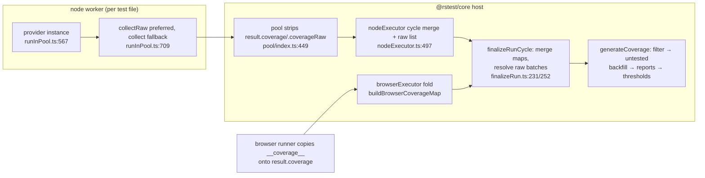

# Coverage pipeline architecture

Coverage spans three packages: `@rstest/core` owns the provider contract, run-cycle merge, and report stage; `@rstest/coverage-istanbul` and `@rstest/coverage-v8` each implement the `CoverageProvider` contract plus an Rsbuild instrumentation plugin. `packages/coverage-v8` has no AGENTS.md; this doc is its architecture reference.

## Purpose and entry points

- `CoverageProvider` contract — `../types/coverage.ts:178`. Required: `init`, `collect`, `createCoverageMap`, `generateCoverageForUntestedFiles`, `generateReports`, `cleanup`. Optional deferred pair: `collectRaw` (`../types/coverage.ts:202`) + `resolveRawCoverage` (`../types/coverage.ts:218`).
- Provider loading: `createCoverageProvider` (`index.ts:64`) resolves through `CoverageProviderMap` (`install.ts:9`); default provider is `istanbul` (`../config.ts:314`). A missing provider package triggers an interactive install pinned to `RSTEST_VERSION` (`install.ts:24`).
- Build-time instrumentation: `addCoveragePlugin` (`../core/rsbuild.ts:128`) loads the provider package's `pluginCoverage` and skips `list` runs.
- Report stage: `generateCoverage` (`generate.ts:178`) — filter, untested-file backfill, `generateReports`, thresholds (`checkThresholds.ts:20`; negative values mean max-uncovered-count, `checkThresholds.ts:98`).
- Raw-payload resolution seam: `resolveAndMergeRawCoverage` (`resolveRawCoverage.ts:16`), called from `finalizeRunCycle` (`../core/finalizeRun.ts:252`).
- Browser per-file fold: `buildBrowserCoverageMap` (`browserCoverageMap.ts:10`), used by `../../../browser/src/browserExecutor.ts:61` and the browser-only watch bespoke path (`../core/runTests.ts:251`).
- Stale-report cleanup: `cleanCoverageReports` (`index.ts:55`), invoked at the top of `runTests` (`../core/runTests.ts:123`).

## Data flow

- **Node**: each worker builds its own provider from `runtimeConfig.coverage` (`../runtime/worker/runInPool.ts:567`), `init()`s it (`../runtime/worker/runInPool.ts:573`), and after the file completes prefers `collectRaw` when the provider also has `resolveRawCoverage` (`../runtime/worker/runInPool.ts:709`). The pool deletes `result.coverage`/`result.coverageRaw` before results reach reporters (`../pool/index.ts:449`) and forwards them to executor callbacks (`../core/executors/nodeExecutor.ts:497`), which expose them on `ExecutorCycleOutcome.coverage` with `loadAssetFiles`/`loadSourceMaps` loaders (`../core/executors/nodeExecutor.ts:568`).
- **Browser**: istanbul-only. v8 provider on a browser-only run throws; mixed runs warn (`../../../browser/src/configValidation.ts:170`). The runner puts `globalThis.__coverage__` on each file result (`../../../browser/src/client/entry.ts:760`); the executor folds these into one map and hands finalize a `map` with no `raw` (`../../../browser/src/browserExecutor.ts:74`).
- **Finalize**: `finalizeRunCycle` merges outcome maps (`../core/finalizeRun.ts:231`), resolves concatenated raw v8 batches on the host (`../core/finalizeRun.ts:252`), then reports via `generateCoverage` unless the run failed without `reportOnFailure` (`../core/finalizeRun.ts:315`).
- **Providers**: istanbul instruments at compile time by pushing `swc-plugin-coverage-instrument` into the SWC rule (`../../../coverage-istanbul/src/plugin.ts:59`); hits accumulate in `globalThis.__coverage__`, merged by `collect` (`../../../coverage-istanbul/src/provider.ts:100`); reports remap through `sourceMappingURL` discovery (`../../../coverage-istanbul/src/utils.ts:379`). v8 does not instrument — its plugin only registers per-environment transform fns and caps `splitChunks.maxSize` at 512KB (`../../../coverage-v8/src/plugin.ts:88`); `init` starts an inspector `Profiler.startPreciseCoverage` session (`../../../coverage-v8/src/provider.ts:684`); `collectRaw` returns a serializable filtered payload (`../../../coverage-v8/src/provider.ts:724`); `resolveRawCoverage` validates and converts payloads via acorn AST + source maps (`../../../coverage-v8/src/provider.ts:698`, `../../../coverage-v8/src/v8AstConverter.ts:153`).

## Key invariants

- Per-file coverage stripping differs by path. **Node**: coverage is stripped at the pool before results reach reporters or state — the deletes (`../pool/index.ts:449`) precede `sink.onTestFileResult` (`../pool/index.ts:461`). **Browser**: per-file results carry `result.coverage` through the sink to `stateManager` and every reporter's `onTestFileResult` during the run (`../../../browser/src/hostController.ts:2902`, `../core/runnerEventSink.ts:90`); `buildBrowserCoverageMap`'s delete (`browserCoverageMap.ts:18`) retroactively mutates those shared result objects at outcome assembly, so long-lived caches end up without coverage, but reporters do observe it at `onTestFileResult` time.
- The deferred v8 path only engages when `collectRaw` returns non-null; a null return falls back to full in-worker `collect` (`../runtime/worker/runInPool.ts:709`). `resolveRawCoverage` receives only non-null payloads and may consume them (`../types/coverage.ts:210`).
- Worker provider `cleanup()` runs in `finally` per file (`../runtime/worker/runInPool.ts:737`); istanbul's cleanup deletes `globalThis.__coverage__` (`../../../coverage-istanbul/src/provider.ts:192`) — skipping it double-counts hits on non-isolated reruns.
- Report-stage coverage failures are caught and downgraded to `process.exitCode = 1` (`generate.ts:369` wraps filtering, backfill, `generateReports`, and thresholds), and both providers handle malformed payloads and per-entry conversion errors the same way (`../../../coverage-v8/src/provider.ts:709`, `../../../coverage-v8/src/provider.ts:836`, `../../../coverage-v8/src/provider.ts:994`, `../../../coverage-v8/src/provider.ts:1002`, `../../../coverage-istanbul/src/provider.ts:104`). But the raw-resolution seam in `finalizeRunCycle` (`../core/finalizeRun.ts:252`) is not error-guarded: its `runCoverageStep` is `runLifecycleStep` (`../core/finalizeRun.ts:135`), which rethrows; the contract permits `resolveRawCoverage` to reject to fail coverage finalization (`../types/coverage.ts:212`); and the `loadSourceMaps`/`loadAssetFiles` awaits inside v8's `collectRawPayloads` sit outside every try/catch (`../../../coverage-v8/src/provider.ts:874`, `../../../coverage-v8/src/provider.ts:921`), with the node executor's loaders also uncaught (`../core/executors/nodeExecutor.ts:107`) — a resource-load rejection propagates out of `finalizeRunCycle`. Worker-side `collect` throws surface as a failed test-file result via `runInPool`'s outer catch (`../runtime/worker/runInPool.ts:723`), not exitCode-and-continue.
- `cleanCoverageReports` must stay on the test-run lifecycle, never an rsbuild compile hook — browser-only mode has no node rsbuild instance and `--passWithNoTests` races the hook (`index.ts:49`).
- `generateReports` takes only a map; reporters and output dir come from constructor options with no per-call override (`../types/coverage.ts:244`).
- setupFiles/globalSetup are pruned post-collection so istanbul and v8 converge on the same output (`generate.ts:227`).
- Memory bounds in `generateCoverage` are deliberate: projects processed sequentially (`generate.ts:263`) and untested files in batches of 25 (`generate.ts:395`). Do not parallelize.
- Exit codes never downgrade: coverage-set non-zero codes must survive later phases (`../core/finalizeRun.ts:297`).

## Coupling points

- Adding a member to the contract (`../types/coverage.ts:178`) → both `../../../coverage-istanbul/src/provider.ts:30` and `../../../coverage-v8/src/provider.ts:225`, plus worker call sites (`../runtime/worker/runInPool.ts:688`).
- `CoverageProviderMap` names (`install.ts:9`) ↔ each package entry must export `{ CoverageProvider, pluginCoverage }` because `loadCoverageProvider` destructures exactly those (`index.ts:33`, `../../../coverage-istanbul/src/index.ts:1`, `../../../coverage-v8/src/index.ts:1`).
- `createFastCoverageMap` and `mapWithConcurrency` are duplicated verbatim in both provider packages (`../../../coverage-istanbul/src/utils.ts:315`, `../../../coverage-v8/src/utils.ts:199`) — change one, mirror the other.
- Bumping `swc-plugin-coverage-instrument` ↔ `COVERAGE_MAGIC_VALUE` used by `readInitialCoverage` (`../../../coverage-istanbul/src/utils.ts:26`).
- Per-environment `transformCoverageFns` registered by the plugins (`../../../coverage-istanbul/src/plugin.ts:66`, `../../../coverage-v8/src/plugin.ts:109`) ↔ `environmentName` forwarded from `generate.ts:293`; on a name miss istanbul throws (`../../../coverage-istanbul/src/plugin.ts:21`) while v8 falls back to a bare SWC transform resolved through `@rstest/core`'s Rspack (`../../../coverage-v8/src/plugin.ts:53`).
- `ExecutorCycleOutcome.coverage` shape: producers `../core/executors/nodeExecutor.ts:568` and `../../../browser/src/browserExecutor.ts:74` ↔ consumer `../core/finalizeRun.ts:233`.

## Gotchas

- `createFastCoverageMap` monkey-patches `merge`/`addFileCoverage` to sum hit counts in place when shapes match, silently falling back to istanbul's slow (allocation-heavy) merge when they differ (`../../../coverage-v8/src/utils.ts:204`); returned maps mutate their inputs' semantics — never assume istanbul's copy-on-merge.
- v8 `collect`/`collectRaw` are one-shot per `init`: both stop the profiler in `finally` even on error (`../../../coverage-v8/src/provider.ts:733`).
- v8 `collectRawPayloads` destroys its input as it goes (`payload.entries.length = 0`, `../../../coverage-v8/src/provider.ts:864`) to cap peak memory; payloads cannot be replayed. Identical-shape entries are pre-merged by summing range counts before conversion (`../../../coverage-v8/src/provider.ts:1125`).
- v8 AST conversion caches prepared coverage in a FIFO of 50 keyed by content-hash cache keys (`../../../coverage-v8/src/v8AstConverter.ts:132`); `applyWithAst` streams into the shared map via `applyV8CoverageWithAst` (`../../../coverage-v8/src/v8AstConverter.ts:165`) unless a subclass overrides `convertWithAst`, detected by prototype comparison (`../../../coverage-v8/src/provider.ts:581`).
- The reporting provider (main process, `../core/runTests.ts:269`) and worker collection providers (`../runtime/worker/runInPool.ts:567`) are distinct instances — instance state set during collection never reaches reporting.
- Bare exclude patterns like `a.ts` are not handed to glob ignore; a manual suffix/segment match filters them so `a.ts` also excludes `lib/a.ts` (`generate.ts:35`).
- istanbul `readInitialCoverage` brace-matches around a magic value and evaluates the extracted object literal in a VM (`../../../coverage-istanbul/src/utils.ts:71`) — it depends on the exact generated-code shape, not on parsing.
- Browser-only **watch** runs bypass `finalizeRunCycle`: a bespoke coverage report runs once after the watch session exits (`../core/runTests.ts:251`). Non-watch browser runs go through the shared finalize like node runs.
- istanbul source-map URL cache never caches failed reads so watch-mode rebuild races retry on the next report (`../../../coverage-istanbul/src/utils.ts:402`).
