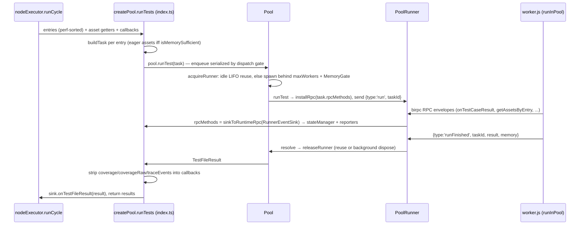

# Node worker pool architecture

This document covers `packages/core/src/pool/` — the node-side worker pool that executes and collects test files in child processes or worker threads. Paths are relative to this directory.

## Purpose and entry points

- `createPool` (`index.ts:245`) is the only public seam. Callers: the node executor (`../core/executors/nodeExecutor.ts:348`) and list-tests (`../core/listTests.ts:203`). It returns `{ runTests, collectTests, close }` — one pool per run, one `runTests` call per project.
- Worker kind is `PoolWorkerKind = 'forks' | 'threads'` (`types.ts:4`), resolved once per pool from `pool.type ?? 'forks'` (`index.ts:305`). Forks = `child_process.fork` with IPC; threads = `worker_threads`.
- Layer split: `Pool` (`pool.ts:14`) is the scheduler (slots, worker ids, idle reuse); `PoolRunner` (`poolRunner.ts:74`) owns one worker's state machine (`IDLE→STARTING→(STARTED | START_FAILURE)→STOPPING→STOPPED`, `poolRunner.ts:67`; `START_FAILURE` means the start handshake failed but a live child may still exist and must be terminated, `poolRunner.ts:201`), birpc transport, and task attribution; `PoolWorker` (`poolWorker.ts:21`) is the transport-only interface implemented by `workers/forksPoolWorker.ts:45` and `workers/threadsPoolWorker.ts:25` over shared scaffolding (`workers/basePoolWorker.ts:31`), selected in `createPoolWorker` (`workers/index.ts:6`).
- `MemoryGate` (`memoryGate.ts:58`) defers new spawns when estimated worker RSS exceeds available memory; `selectMemoryGate` enables it for forks only (`memoryGate.ts:263`).
- `protocol.ts` defines the three tagged IPC envelopes (`protocol.ts:8`): lifecycle requests (`start`/`run`/`collect`, `protocol.ts:12`), responses (`started`/`runFinished`/`collectFinished`/`fatal_error`, `protocol.ts:37`), and an opaque birpc passthrough envelope (`protocol.ts:63`).
- Worker entry is the built `worker.js` (`index.ts:328`), compiled from `../runtime/worker/index.ts` (`../../rslib.config.ts:103`). `rstestSuppressWarnings.cjs` (patches `process.emit` to drop `ExperimentalWarning`, `rstestSuppressWarnings.cjs:3`) is injected via `--require` next to `--experimental-vm-modules` (`index.ts:60`) and copied verbatim into dist (`../../rslib.config.ts:118`).

## Data flow

Entries arrive perf-sorted from `sortTestEntries` (`../core/executors/nodeExecutor.ts:482`); assignment to workers is pull-based — there is no per-worker file partitioning, each entry claims the next free slot.

Crash path: a rejected `pool.runTest` is converted by `workerErrorToResult` (`index.ts:178`) into a fail-status file result; test cases running at crash time become synthetic failed results (`index.ts:215`) and are replayed through reporters' `onTestCaseResult` only — the state manager is deliberately not touched (`index.ts:439`).

## Key invariants

- A caller's pool slot is claimed synchronously before the first `await` in `acquireRunner` (`pool.ts:72`); the sequential dispatch gate in `runTests` (`index.ts:374`) relies on this to keep perf-sorted enqueue order. Do not add an early `await` there.
- One task per runner at a time (`poolRunner.ts:270`); the birpc channel is per-task — installed at dispatch (`poolRunner.ts:278`) and disposed when the task settles (`poolRunner.ts:299`).
- Capacity accounting counts stopping runners (`pool.ts:140`); a slot and its worker id are freed only after the child actually exits (`pool.ts:242`). Worker ids are bounded `[1, maxWorkers]` and reused (`pool.ts:35`, allocated at `pool.ts:169`) — consumers depend on `RSTEST_WORKER_ID` for resource partitioning.
- `crashed` is set before rejecting the task (`poolRunner.ts:334`, transport errors at `poolRunner.ts:398`) so `isUsable()` (`poolRunner.ts:109`) stops `releaseRunner` (`pool.ts:191`) from recycling a poisoned runner under `isolate: false`.
- The host owns termination — no stop handshake over IPC (`poolRunner.ts:174`), and the worker installs no SIGTERM handler that defers exit (`../runtime/worker/index.ts:138`); profiling runs (`--prof`/`--perf`/`--cpu-prof`/`--heap-prof`/`--diagnostic-dir`) install one that unconditionally `process.exit()`s (`../runtime/worker/setup.ts:22`, wired at `../runtime/worker/index.ts:14`), which is compatible with that contract. Violating it reintroduces the rstest#1275 hang.
- MemoryGate is forks-only (`memoryGate.ts:259`): thread RSS is host-wide and collapses parallelism (rstest#1301). Symmetrically the worker skips RSS reporting off the main thread (`../runtime/worker/index.ts:103`). The gate must always admit at least one worker (`memoryGate.ts:113`).
- Every IPC message is a tagged envelope; unknown messages are dropped (`poolRunner.ts:311`), and non-lifecycle envelopes fall through to the worker-side rpc listener (`../runtime/worker/index.ts:144`).
- Runner lifecycle events reach reporters/stateManager via `RunnerEventSink` — `rpcMethods` are `sinkToRuntimeRpc(sink)` (`index.ts:365`, sink API at `../core/runnerEventSink.ts:145`) — with one deliberate exception: host-synthesized crashed-case results are replayed straight to reporters' `onTestCaseResult` (`index.ts:439`) because the runner is dead and the state manager must not double-count; the crashed file result itself still flows through the sink (`index.ts:461`).

## Coupling points

- `WorkerRequest`/`WorkerResponse` (`protocol.ts:12`, `protocol.ts:37`) ↔ worker-side dispatch (`../runtime/worker/index.ts:150`) and host-side `handleResponse` (`poolRunner.ts:314`). New message types must land on both ends.
- Adding a `PoolWorkerKind` (`types.ts:4`) → `createPoolWorker`'s switch (`workers/index.ts:11`, exhaustiveness-checked at `workers/index.ts:31`) and `selectMemoryGate` (`memoryGate.ts:259`).
- `WorkerMemoryReport` (`protocol.ts:32`): produced at `../runtime/worker/index.ts:118`, consumed by `MemoryGate.attachWorker` (`memoryGate.ts:151`). The `RSTEST_MEMORY_AWARE=0` kill switch is read independently in host (`memoryGate.ts:242`) and worker (`../runtime/worker/index.ts:104`).
- `buildId` threaded into task context (`index.ts:138`) ↔ worker-side rebuild-boundary cache flush (`../runtime/worker/runInPool.ts:424`). Changing its scoping breaks `isolate: false` cross-project cache sharing (#1376).
- Worker id: allocated in `pool.ts:169`, delivered in the `start` request (`poolRunner.ts:146`), exported as `RSTEST_WORKER_ID` in `../runtime/worker/index.ts:88`.
- `RuntimeRPC` methods the worker calls (`../runtime/worker/runInPool.ts:616`) ↔ `sinkToRuntimeRpc` (`../core/runnerEventSink.ts:145`) plus the pool-added `getAssetsByEntry` override (`index.ts:159`).
- Node exec flags (`index.ts:62`) ↔ the suppress-warnings copy in `../../rslib.config.ts:118` — the `--require` path resolves relative to dist, so renaming/moving the `.cjs` needs both sides.

## Gotchas

- Two stale in-source comments: `poolWorker.ts:17` claims "exactly one implementation (`ForksPoolWorker`)" — `ThreadsPoolWorker` exists; `workers/threadsPoolWorker.ts:93` mentions a graceful "`stop` envelope / `stopped`" handshake that does not exist in `protocol.ts` (stop is signal/terminate only).
- Assets have two delivery paths that must both stay alive: eager in the task when host memory is sufficient (`index.ts:149`), else lazily pulled by the worker via `rpc.getAssetsByEntry` (`../runtime/worker/runInPool.ts:578`).
- birpc's timeout is disabled (`poolRunner.ts:236`) — a host rpc method that never resolves hangs the worker task indefinitely.
- stderr attribution: buffer is reset per task on reused workers (`poolRunner.ts:283`); task rejection is deferred up to 200 ms for stderr to settle (`poolRunner.ts:422`, cap at `workers/stderrCapture.ts:4`); attached stderr is truncated to 64 KB head+tail (`poolRunner.ts:16`).
- Forks listen on `exit`, not `close` (`workers/forksPoolWorker.ts:99`): a grandchild inheriting stdio cannot stall slot reclaim, but its late output can miss the settle window.
- Fork stop escalates SIGTERM→SIGKILL after 500 ms (`workers/forksPoolWorker.ts:17`); thread stop is a bare `terminate()` and `force` is a no-op (`workers/threadsPoolWorker.ts:89`).
- On an internal worker failure the worker sends `fatal_error` then re-throws through Node's default handler to kill itself (`../runtime/worker/index.ts:128`) — it must exit, or `isolate: false` would reuse a poisoned process. Host keeps `lastFatalError` to enrich a later unexpected exit (`poolRunner.ts:338`).
- Start ack handlers and the 90 s timeout (`poolRunner.ts:15`) are installed before awaiting `worker.start()` (`poolRunner.ts:123`); an instant child death otherwise hangs the start.
- Bun forces `json` IPC serialization for forks (`workers/forksPoolWorker.ts:73`, `../utils/helper.ts:255`) — values that only survive `advanced` (structured clone) will not round-trip there.
- `minWorkers` is internal-only (min of `maxWorkers` and the CPU recommendation, `index.ts:325`); it is a floor for retained idle runners, not a reuse cap — a pending slot waiter always wins reuse (`pool.ts:211`).
- Parent `execArgv` is propagated to workers minus `--prof`/`--title` (`index.ts:287`).
