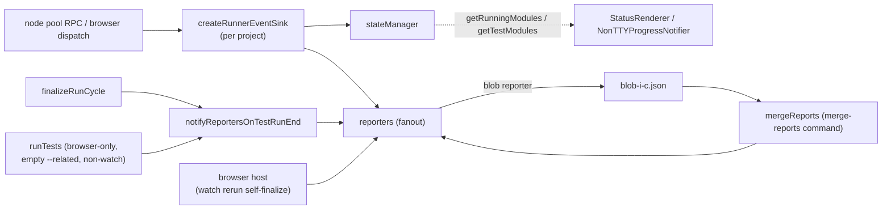

# Reporter subsystem architecture

Terminal, CI, and machine-readable output for test runs in `@rstest/core`. Reporters are passive consumers: they never pull state from the pool or browser host — every event arrives through `RunnerEventSink` or the run-end finalize path.

## Purpose and entry points

- `Reporter` interface (`../types/reporter.ts:191`) — all hooks optional. `flushOutputStreams` (`../types/reporter.ts:196`) tells the run loop whether to flush piped stdio after `onTestRunEnd`; the `onTestRunEnd` payload shape is defined at `../types/reporter.ts:234`.
- Registry: `reportersMap` (`../core/rstest.ts:326`), locked to the `BuiltInReporterNames` union (`../types/reporter.ts:27`) via `satisfies` — adding a name on one side without the other is a compile error.
- Selection/instantiation: `createReporters` (`../core/rstest.ts:337`), called during `Rstest` construction. `command === 'list'` gets zero reporters (`../core/rstest.ts:249`); `merge-reports` drops `BlobReporter` instances (blobs are consumed, not produced — `../core/rstest.ts:261`). Unknown names throw (no third-party loading yet).
- Defaults: `getDefaultReporters` (`../config.ts:232`) returns `['default']`, plus `'github-actions'` when `isGithubActions()` (`../config.ts:223`, reads `process.env.GITHUB_ACTIONS === 'true'` at call time so the build-time define can force it off). Seeds default config at `../config.ts:272`.
- Classes: `DefaultReporter` `index.ts:21`; `VerboseReporter` `verbose.ts:12` (extends default); `DotReporter` `dot.ts:34`; `MdReporter` `md.ts:732`; `GithubActionsReporter` `githubActions.ts:33`; `JUnitReporter` `junit.ts:51`; `JsonReporter` `json.ts:68`; `BlobReporter` `blob.ts:43`. `summary.ts` is not a reporter — it holds the shared summary/error printers used by default and dot (`summary.ts:166`, `summary.ts:190`).

## Data flow

- Mid-run events reach reporters only via the per-project sink (`../core/runnerEventSink.ts:48`): the four state-updating methods (`onTestCaseStart`, `onTestCaseResult`, `onTestFileStart`, `onTestFileResult`) update `stateManager` before the `Promise.all` reporter fanout (`../core/runnerEventSink.ts:56`, `../core/runnerEventSink.ts:64`, `../core/runnerEventSink.ts:70`, `../core/runnerEventSink.ts:91`); the remaining methods (`onTestFileReady`, `onTestSuiteStart`, `onTestSuiteResult`, `onConsoleLog`) are fanout-only and never touch `stateManager` (`../core/runnerEventSink.ts:75`, `../core/runnerEventSink.ts:99`). `onTestCaseStart` is fire-and-forget (`../core/runnerEventSink.ts:59`); `onConsoleLog` applies `disableConsoleIntercept` and the project `onConsoleLog` filter before `onUserConsoleLog` fanout (`../core/runnerEventSink.ts:105`, `../core/runnerEventSink.ts:113`); `onTestFileResult` also ingests `snapshotResult` (`../core/runnerEventSink.ts:95`).
- Run end: `notifyReportersOnTestRunEnd` (`../core/finalizeRun.ts:95`) awaits each reporter's `onTestRunEnd` in registration order with `{results, coverage: coverageMap.toJSON(), testResults, unhandledErrors, snapshotSummary, duration, getSourcemap, filterRerunTestPaths}` (`../core/finalizeRun.ts:111`), then flushes stdio unless `reporter.flushOutputStreams === false` (`../core/finalizeRun.ts:121`). It is invoked from `finalizeRunCycle` (`../core/finalizeRun.ts:301`) and from the browser-only empty `--related` fast path in non-watch runs (`../core/runTests.ts:201`); `onTestRunStart` fanout is `../core/finalizeRun.ts:87`. Browser watch reruns do NOT go through it: the browser host self-finalizes each rerun by calling `reporter.onTestRunEnd` directly (`packages/browser/src/hostController.ts:2359`; error path `packages/browser/src/hostController.ts:2256`), per the browser AGENTS finalize-ownership split ("watch runs self-finalize host-side; core skips its finalize entirely").
- `results`/`testResults` come from `context.reporterResults`, sorted by `testPath` (`../core/rstest.ts:314`) — presentation order is deterministic, decoupled from execution order.
- `filterRerunTestPaths` is set only in watch mode (`../core/finalizeRun.ts:310`); it scopes the failing-test summary to the rerun (`summary.ts:205`).
- Sharding: `BlobReporter` serializes the whole run — results, testResults, coverage, duration, snapshotSummary, unhandledErrors, buffered console logs — to `<outputDir>/blob[-index-count].json` (`blob.ts:82`, filename grammar single-owned at `blob.ts:36` / `blob.ts:39`). `mergeReports` loads via `isBlobFile` (`../core/mergeReports.ts:29`), replays console logs (`../core/mergeReports.ts:168`) and `onTestFileResult` (`../core/mergeReports.ts:206`) into the remaining reporters, then calls `onTestRunEnd` with merged data and an always-null `getSourcemap` (`../core/mergeReports.ts:213`, `../core/mergeReports.ts:222`).

## TTY rendering internals

- `DefaultReporter` picks `StatusRenderer` when `isTTY()` or a custom `options.logger` is given, else `NonTTYProgressNotifier` (`index.ts:51`).
- `StatusRenderer` (`statusRenderer.ts:22`) derives the sticky bottom window from `testState` (running modules + finished modules); running case names appear only after 2 s (`statusRenderer.ts:61`).
- `WindowRenderer` (`windowedRenderer.ts:45`, Vitest-derived) monkey-patches `process.stdout/stderr.write` process-globally (`windowedRenderer.ts:74`), buffers intercepted writes, and re-renders on a 1 s interval (`windowedRenderer.ts:19`) throttled to one render per 100 ms (`windowedRenderer.ts:123`). `suspendWindowOutput`/`resumeWindowOutput` are ref-counted (`windowedRenderer.ts:259`); interception is released only by `stop()`, not `finish()` (`windowedRenderer.ts:92`, `windowedRenderer.ts:101`).
- `NonTTYProgressNotifier` prints `[PROGRESS]` lines after 30 s of silence (`nonTtyProgressNotifier.ts:5`), plus slow-case detail past 10 s. Auto-rescheduling stops after 20 reports (`MAX_REPORT_COUNT`, `nonTtyProgressNotifier.ts:8`, `nonTtyProgressNotifier.ts:61`), but each `notifyOutput()` unconditionally re-arms a one-shot report even past the cap (`nonTtyProgressNotifier.ts:40`), so the 20-report ceiling only bounds consecutive silent-interval reports, not the total. `notifyOutput()` also resets the idle timer, so reports only fire during genuine silence.

## Key invariants

- No direct reporter fanout from hosts: all mid-run events go through `RunnerEventSink` (`../core/runnerEventSink.ts:16`), and the sink methods that update `stateManager` (`onTestCaseStart`, `onTestCaseResult`, `onTestFileStart`, `onTestFileResult`) do so before reporter fanout (`../core/runnerEventSink.ts:56`, `../core/runnerEventSink.ts:64`, `../core/runnerEventSink.ts:70`, `../core/runnerEventSink.ts:91`) — the TTY renderers read state, not event payloads.
- `reportersMap` must cover `BuiltInReporterNames` exactly (`../core/rstest.ts:326`).
- Blob filename grammar is owned by `blob.ts:36`; `mergeReports` must keep using `isBlobFile` rather than re-encoding the pattern.
- `flushOutputStreams = false` for reporters that do not write to process stdio is a documented convention, not an enforced invariant (`../types/reporter.ts:193`): default/dot derive it from `options.logger` (`index.ts:50`, `dot.ts:58`), GithubActions hardcodes `true` (`githubActions.ts:34`), but `BlobReporter` (file-only output — `blob.ts:43`, writes at `blob.ts:101`) omits it and therefore still triggers the stdio flush (`../core/finalizeRun.ts:121` gates on `!== false`).
- `verbose` forces `summary: true` (`verbose.ts:32`); `summary: false` short-circuits all run-end output in default and dot (`index.ts:161`, `dot.ts:104`).
- The md output format is a spec'd contract (`md.ts:1` header comment) snapshot-tested in `e2e/reporter/md.test.ts` (`md.ts:6`) — behavior changes require snapshot updates there.
- Any direct log emitted by `DefaultReporter` while the status window is live must go through `withSuspendedStatusRenderer` (`index.ts:70`), or the window redraw garbles it.

## Coupling points

- New built-in reporter name → update `BuiltInReporterNames` (`../types/reporter.ts:27`), `BuiltinReporterOptions` (`../types/reporter.ts:174`, not compile-guarded), and `reportersMap` (`../core/rstest.ts:326`).
- `BlobData` shape (`blob.ts:16`) ↔ `mergeReports` reader, which is a `JSON.parse` cast with no validation (`../core/mergeReports.ts:40`); `version` comes from the build-injected `RSTEST_VERSION` define (`rslib.config.ts:192`, package-root relative).
- `onTestRunEnd` payload: `Reporter` type (`../types/reporter.ts:234`) ↔ `notifyReportersOnTestRunEnd` (`../core/finalizeRun.ts:111`) ↔ the merge path (`../core/mergeReports.ts:213`) — three call sites must stay shape-compatible.
- `deriveRunCounts` (`utils.ts:27`) is the single owner of run-end counts for md + json; pass/fail verdicts deliberately stay per-reporter (json fails an empty run unless `passWithNoTests`, `json.ts:137`). json also stamps a `repro` command (`buildPackageManagerReproCommand`, `utils.ts:228`) onto each failed test entry, resolving the package manager once per run end (`json.ts:214`).
- Summary labels (`summary.ts:160`) are shared between the live status window (`statusRenderer.ts:84`) and the final summary — padding changes affect both.

## Gotchas

- `GithubActionsReporter` types `options.onWritePath` as required (`githubActions.ts:53`) but `createReporters` never supplies it; runtime survives via optional chaining in the `::error` annotation (`githubActions.ts:139`). The step summary is written only when `GITHUB_STEP_SUMMARY` is set (`githubActions.ts:60`) and truncates at 20 failures / 20 flaky tests (`githubActions.ts:179`).
- `DotReporter` declares `testState`/`projectConfigs` constructor params but ignores them (`dot.ts:47`); it writes markers directly to the output stream with manual column wrapping (`dot.ts:66`).
- `MdReporter` bypasses the logger and writes via `process.stdout.write` (`md.ts:1199`); json/junit print to stdout via `logger.log` unless `outputPath` is set, and fall back to stdout on write failure (`json.ts:176`, `junit.ts:263`).
- `NonTTYProgressNotifier` uses `console.log` directly (`nonTtyProgressNotifier.ts:95`) — an exception to the package's "use logger utilities" rule.
- `DefaultReporter` hides passing cases unless the run has exactly one test file, or the case failed, exceeded `slowTestThreshold`, or was retried (`index.ts:113`, `index.ts:119`); `VerboseReporter` logs every case (`verbose.ts:67`).
- md's "focused run" heuristic (`md.ts:759`): CLI file filters, `testNamePattern`, or ≤ a small total test count trigger the passing-run Tests section.
- JUnit's `errors` attribute is always 0 (`junit.ts:242`); text is ANSI-stripped and filtered to XML-1.0-valid code points before escaping (`junit.ts:66`).
