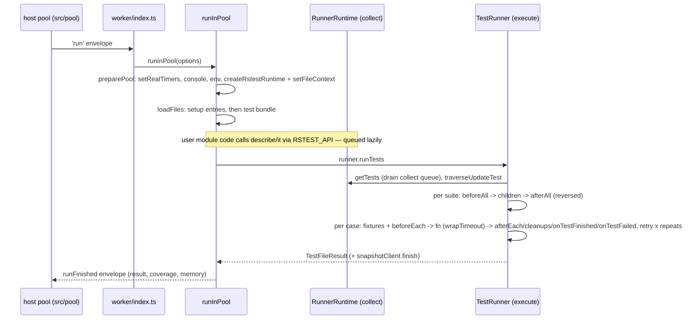

# Test runtime architecture

Everything in `src/runtime/` executes inside the test execution context — a forks child process or worker_thread in node mode, or the browser page in browser mode (re-exported through `../browserRuntime.ts:15`) — never in the host CLI process. Host counterparts live in `src/pool/` (scheduling, envelope protocol) and `src/core/runnerEventSink.ts`; the worker talks to them over a channel (lifecycle envelopes + birpc with timeout disabled, `worker/rpc.ts:44`).

## Purpose and entry points

- `worker/index.ts:143` — node worker entry: routes `start` envelopes to `handleStart` (`worker/index.ts:87`) and `run`/`collect` envelopes through `runTask` (`worker/index.ts:106`) to `runInPool`; bottom-of-stack fatal handlers fire only when no task is active (`worker/index.ts:73`, `worker/index.ts:84`).
- `worker/runInPool.ts:392` — `runInPool`, per-file orchestration: `preparePool` (`worker/runInPool.ts:129`) captures real timers (`worker/runInPool.ts:144`), intercepts console (`worker/runInPool.ts:208`), sets up the DOM environment via the loader registry (`worker/runInPool.ts:276`, `worker/env/registry.ts:12`), then loads setup + test bundles and drives `runner.runTests` (`worker/runInPool.ts:616`), forwarding every `RunnerHooks` event to the host over rpc.
- `api/index.ts:40` — `createRstestRuntime`, assembles the injected API (`test`/`describe`/`expect`/`rstest`/…) and publishes it as `globalThis.RSTEST_API` (`api/index.ts:86`); user bundles reach it through the forwarders in `api/public.ts:54` or, under `globals: true`, via `globalThis` registration (`worker/runInPool.ts:291`) driven by the `globalApis` list (`../utils/constants.ts:299`).
- `runner/index.ts:42` — `createRunner`, the per-file rebinding point: builds `RunnerRuntime` (collection) + `TestRunner` (execution) and publishes them as one `FileContext` (`runner/index.ts:72`, `fileContext.ts:28`).
- `runner/runtime.ts:66` — `RunnerRuntime`: registers suites/cases lazily (`runner/runtime.ts:251`), drains the collect queue in `getTests` (`runner/runtime.ts:349`); the stable collection API surface is built once at module load (`runner/runtime.ts:791`).
- `runner/runner.ts:69` — `TestRunner.runTests`: suite tree walk, hooks, fixtures, retry/repeats, per-test expect state.
- `util.ts:78` — `REAL_TIMERS` registry: `setRealTimers` captures the genuine globals (`util.ts:85`), `getRealTimers` serves them back (`util.ts:93`); `getRealNow` pins `Date.now` at module load (`util.ts:101`).
- `api/fakeTimers.ts:51` — `FakeTimers` over `@sinonjs/fake-timers`; `api/utilities.ts:128` — the `rstest`/`rs` utilities singleton (stubs, timers, spies, config).

## Data flow

Each hook event (`onTestCaseStart`, `onTestSuiteResult`, …) is awaited over rpc to the host's `RunnerEventSink` (`worker/runInPool.ts:616`); bail counts also come from the host (`worker/runInPool.ts:553`, `runner/runner.ts:411`).

## Key invariants

- **Live-binding contract** (`api/index.ts:15`): under `isolate: false` one worker runs many files while user modules persist, so every injected API member is built once with a stable identity and resolves the running file's `FileContext` at call time (`fileContext.ts:36`) — `runtimeAPI` (`runner/runtime.ts:618`), file `expect` (`api/expect.ts:199`), `rstest` utilities (`api/utilities.ts:128`). The lone exception is per-test `context.expect`, deliberately pinned for `test.concurrent` isolation (`runner/runner.ts:751`).
- **No raw timer globals in `src/runtime/`**: calls to `setTimeout` etc. are lint-banned (`../../../../rslint.config.mts:24`) because fake timers replace them in user tests; go through `getRealTimers()` (`runner/task.ts:295`, `api/utilities.ts:20`). New timer needs mean extending `REAL_TIMERS` (`util.ts:78`).
- **`GLOBAL_EXPECT` is a one-time singleton** (`api/expect.ts:208`); later files reset its state via `setState` with `freshExpectState` — a descriptor merge that must preserve the `testPath` getter (`api/expect.ts:122`). The runner re-seeds matcher state before every test (`runner/runner.ts:835`) and enforces `expect.assertions` after it (`runner/runner.ts:863`).
- **Retry/repeat handler truncation**: `onFinished`/`onFailed` lengths are snapshotted per attempt and truncated afterwards so retries do not stack leftover handlers (`runner/runner.ts:133`, `runner/runner.ts:344`). Retry budget is per-test-over-config (`runner/runner.ts:540`); any repeat failure short-circuits remaining repeats (`runner/runner.ts:565`).
- **`buildId` cache flush**: on a reused `isolate: false` worker, all loader caches flush exactly once per watch rebuild — `buildId` is run-scoped, never per-project (`worker/runInPool.ts:66`, `worker/runInPool.ts:424`).
- **Time mocking is undone before worker reuse / leak collection**: `useRealTimers()` must run even for a Date-only `setSystemTime` pin, which leaves `isFakeTimers()` false (`worker/runInPool.ts:664`, `api/fakeTimers.ts:240`).
- **`globalApis` exhaustiveness**: a new `Rstest` key missing from `globalApiList` fails compilation (`../utils/constants.ts:325`).

## Coupling points

- New `Rstest` API member → add to `globalApiList` (`../utils/constants.ts:299`) **and** export a forwarder in `api/public.ts:54` for real-module importers; build it per the live-binding contract (`api/index.ts:15`), not as a per-file closure.
- New `RunnerHooks` callback in `runner/runner.ts` → forward it in the `runInPool` hooks object (`worker/runInPool.ts:616`) and check the browser client entry (`packages/browser/src/client/entry.ts`), which builds its own hooks against `createRstestRuntime`.
- New test environment → extend `EnvironmentName` and add a loader entry (`worker/env/registry.ts:12`); `node` stays the inline fast path (`worker/runInPool.ts:276`).
- Runner code needing current-task attribution → use only the `TaskContext` interface (`worker/taskContext.ts:4`); node backs it with `AsyncLocalStorage` (`worker/taskContext.node.ts:6`), the browser with a single slot that mis-attributes concurrent tasks (`worker/taskContext.browser.ts:6`).
- Snapshot plumbing spans three layers: `ensureSnapshotClient` attaches the `@vitest/snapshot` client to worker state (`api/snapshot.ts:148`), the runner drives `setup`/`finish` (`runner/index.ts:79`, `runner/runner.ts:660`), and `.snap` path resolution round-trips to the host via `rpc.resolveSnapshotPath` (`worker/snapshot.ts:18`, `worker/runInPool.ts:224`).
- Anything the browser client needs from this directory must be re-exported through `../browserRuntime.ts:15` (browser-safe modules only — no node imports).

## Gotchas

- Assertions/snapshots are `@vitest/expect` + `@vitest/snapshot`, wired through chai plugins (`api/expect.ts:100`, `api/snapshot.ts:164`); the snapshot plugin resolves the client through `fileContext()` at assert time, and inline snapshots outside a test fall back to file-level metadata (`api/snapshot.ts:136`).
- Fixture dependency detection parses `fn.toString()` — the first parameter must be an object destructuring pattern, rest properties throw (`runner/fixtures.ts:203`, `runner/fixtures.ts:214`).
- `wrapTimeout` returns the fn unwrapped when `timeout` is falsy, so `timeout: 0` disables the guard entirely (`runner/task.ts:288`).
- `describe` bodies may be async; registration is queued and drained later (`runner/runtime.ts:251`), so registering after collection ends throws `TestRegisterError` (`runner/runtime.ts:129`). `test()` (or `describe()`) inside a running `test()` throws the same `TestRegisterError` from `checkStatus` (`runner/runtime.ts:129`), which `formatTestError` (`util.ts:123`) rewrites to "Test 'X' cannot run because it is nested within test 'Y'" — the nested-registration guard at `runner/runtime.ts:313` is a defensive collection-stack check, not the path that fires for this scenario.
- Adjacent `.concurrent` tests are batched with `Promise.all` under `limitConcurrency(maxConcurrency)` — suites in the batch are not concurrency-limited, only cases (`runner/runner.ts:352`, `runner/task.ts:319`).
- `process.exit`/self-`kill` are hijacked to throw during a run (`worker/runInPool.ts:433`); worker-level fatal errors hand off to Node's default handler after best-effort IPC, never `process.exit(1)` (`worker/index.ts:57`).
- Console forwarding to the host is fire-and-forget with rejections swallowed — a late log after channel close is dropped, not an `unhandledRejection` (`worker/runInPool.ts:195`).
- `run`/`collect` durations use `RealDate` captured at module load (`runner/runner.ts:45`) and `getRealNow` (`util.ts:101`) so fake timers cannot skew them; RSS memory reporting is forks-only (`worker/index.ts:103`).
- `useFakeTimers()` returns a disposable that restores the _previous_ timer state (including a Date-only pin) via a LIFO stack (`api/utilities.ts:461`); `useRealTimers()` clears the whole stack (`api/utilities.ts:475`). `resetForFile` clears stub bookkeeping between files but intentionally keeps the weak mock registry (`api/utilities.ts:637`).
- `@sinonjs/fake-timers` is loaded lazily with `require` to keep the timer API sync (`api/fakeTimers.ts:41`); `install` never fakes `Intl`/`nextTick`/`queueMicrotask` by default (`api/fakeTimers.ts:204`).
