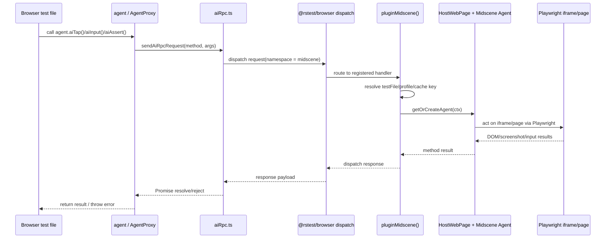

# @rstest/midscene

Midscene integration for Rstest browser mode.
This package adds a browser-side `agent` API plus a host-side Rsbuild plugin.

## Scope

- Browser-side entry: `src/index.ts`, `src/agentProxy.ts`, `src/aiRpc.ts`
- Host-side entry: `src/plugin.ts`, `src/hostWebPage.ts`
- Shared protocol/types: `src/protocol.ts`
- Validation harness today lives in `examples/midscene/`
- There is currently no package-local `test` script in `packages/midscene/package.json`

## Runtime interaction



## Architecture notes

- Keep browser-side code thin: it should proxy calls and own minimal runtime detection only
- Keep host-side code authoritative: provider checks, agent lifecycle, env loading, and caching live there
- `src/protocol.ts` is the contract boundary; update it first when changing RPC shape
- `src/hostWebPage.ts` is the Playwright-specific adapter boundary; avoid spreading Playwright details elsewhere
- Dynamic imports are intentional for optional or host-only dependencies (`dotenv`, `sharp`, `@midscene/core`, local built `.js` files)
- Example tests exercise the built package output, so source edits do not affect examples until rebuild

## Commands

```bash
# Install workspace deps
pnpm install

# Build this package
pnpm --filter @rstest/midscene build

# Watch build
pnpm --filter @rstest/midscene dev

# Typecheck this package
pnpm --filter @rstest/midscene typecheck

# Broader repo validation when needed
pnpm lint
pnpm typecheck
```

## Focused validation commands

```bash
# Lint one changed TS file
pnpm biome check --write 'packages/midscene/src/plugin.ts'

# Lint all TS files in this package
pnpm biome check 'packages/midscene/src/**/*.ts'

# Typecheck only this package after edits
pnpm --filter @rstest/midscene typecheck
```

## Test commands

Use the example app as the current test harness.
Rebuild `@rstest/midscene` before running these, otherwise the example resolves stale `dist/` output.

```bash
# Rebuild package, then run the example suite
pnpm --filter @rstest/midscene build
pnpm --filter @examples/midscene test

# Run a single Midscene example test file (preferred fast loop)
pnpm --filter @rstest/midscene build
pnpm --filter @examples/midscene exec rstest 'tests/agent.test.ts'

```

## Import conventions

- Let Biome organize imports; do not hand-preserve custom ordering unless required
- Put `node:` builtins first, external packages next, relative imports last
- Prefer separate `import type` statements for type-only usage
- Keep relative imports shallow and local; if a contract is shared, move it to `src/protocol.ts`
- For runtime ESM imports that target built output, keep explicit `.js` suffixes in dynamic local imports

## Formatting conventions

- Use 2-space indentation and LF line endings
- Use single quotes in TS/JS
- Keep trailing commas and multiline wrapping as produced by Biome
- Prefer small helpers over deeply nested inline expressions when logic becomes branchy
- Use numeric separators for large constants (example: `120_000`)

## Types and API design

- Use `interface` for public option bags and structured objects
- Use `type` for unions, mapped types, aliases, and tuple overloads
- Prefer `unknown` at untrusted boundaries, then narrow with guards
- Avoid `any` unless an upstream API makes it unavoidable; isolate casts at the boundary
- Keep generic helpers constrained and local; do not add clever type machinery without payoff
- Return explicit `Promise<void>` / `Promise<T>` in async public methods
- Re-export public types from `src/index.ts` instead of making callers reach into internals

## Naming conventions

- camelCase for files, locals, functions, and helper constants
- PascalCase for classes, interfaces, and exported types
- SCREAMING_SNAKE_CASE for true constants such as protocol namespaces/timeouts
- Boolean names should read clearly (`isObject`, `messageListenerInitialized`, `cached`)
- Prefer descriptive suffixes like `Options`, `Context`, `Result`, `Map`, `Request`, `Response`

## Error handling

- Fail fast on invalid config, unsupported providers, malformed RPC payloads, and missing required runtime state
- Use `throw new Error(...)` with actionable messages; include package prefix when the error crosses package boundaries
- Normalize unknown errors with `error instanceof Error ? error : new Error(String(error))`
- Use `console.warn(...)` only for recoverable conditions such as missing optional runtime pieces
- Avoid silent catch blocks unless optional behavior is truly best-effort; if swallowed, keep the scope narrow
- Reject or throw at the boundary, not deep inside unrelated helpers

## Package-specific implementation guidance

- Keep `AgentProxy` methods as thin delegations; argument normalization is OK, business logic is not
- Keep protocol method lists and guards in sync when adding/removing RPC methods
- Cache host-side Midscene agents by `testFile + profile` unless there is a clear isolation bug
- Preserve provider gating in `plugin.ts`; this package is Playwright-only today
- Keep `HostWebPage` focused on coordinate translation, screenshotting, input bridging, and cache feature lookup
- Prefer JSDoc for non-obvious contracts and architecture boundaries

## Repo-specific AI rules

- No repo-local Cursor rules were found in `.cursor/rules/` or `.cursorrules`
- No repo-local Copilot instructions were found in `.github/copilot-instructions.md`
- Follow the root `AGENTS.md` and this package file as the active agent instructions

## Avoid

- Do not edit `dist/` directly
- Do not spread Playwright-only logic into browser-side files
- Do not change `@rstest/browser/internal` assumptions casually; treat them as fragile integration points
- Do not add dependencies without discussion
- Do not run full e2e suites or repo-wide speculative rewrites without explicit need
